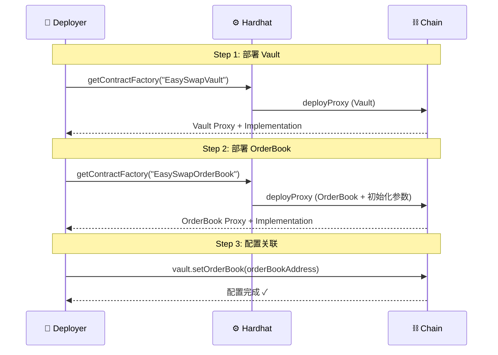
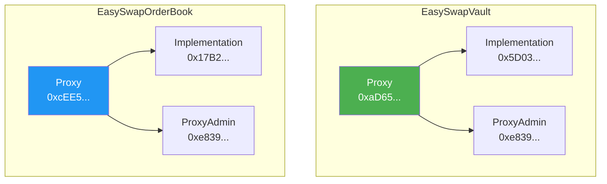

# EasySwap 合约部署指南

> 本文档详细介绍 EasySwap 智能合约的部署流程，包括环境准备、部署步骤、合约初始化等内容。

---

## 📋 部署概览

EasySwap 项目包含两个核心可升级合约，需要按顺序部署：


| 顺序 | 合约 | 说明 |
|:---|:---|:---|
| 1️⃣ | EasySwapVault | 资产托管金库 |
| 2️⃣ | EasySwapOrderBook | 订单簿核心合约 |
| 3️⃣ | 配置关联 | Vault 设置 OrderBook 地址 |

---

## 🛠️ 环境准备

### 1. 安装依赖

```bash
cd EasySwapContract
npm install
```

### 2. 配置环境变量

```bash
cp .env.example .env
```

编辑 `.env` 文件：

```env
# Alchemy RPC API Key
SEPOLIA_ALCHEMY_AK=your_alchemy_api_key

# 部署账户私钥 (不要带 0x 前缀)
SEPOLIA_PK_ONE=your_deployer_private_key

# 第二个测试账户 (可选)
SEPOLIA_PK_TWO=another_private_key

# 主网部署 (可选)
MAINNET_ALCHEMY_AK=your_mainnet_alchemy_key
MAINNET_PK=your_mainnet_private_key
```

> ⚠️ **安全警告**：私钥绝对不要提交到 Git！确保 `.env` 在 `.gitignore` 中。

### 3. 获取测试 ETH

- Sepolia Faucet: https://sepoliafaucet.com/
- Alchemy Faucet: https://sepoliafaucet.com/

---

## 📦 部署步骤

### 一键部署

```bash
npx hardhat run --network sepolia scripts/deploy.js
```

### 部署输出示例

```
deployer:  0xYourDeployerAddress...

esVault contract deployed to: 0xaD65f3dEac0Fa9Af4eeDC96E95574AEaba6A2834
0x5D034EA7F15429Bcb9dFCBE08Ee493F001063AF0  esVault getImplementationAddress
0xe839419C14188F7b79a0E4C09cFaF612398e7795  esVault getAdminAddress

esDex contract deployed to: 0xcEE5AA84032D4a53a0F9d2c33F36701c3eAD5895
0x17B2d83BFE9089cd1D676dE8aebaDCA561f55c96  esDex getImplementationAddress
0xe839419C14188F7b79a0E4C09cFaF612398e7795  esDex getAdminAddress

esVault setOrderBook tx: 0x...
```

---

## 🔧 部署脚本详解

### deploy.js 流程



### 核心代码

```javascript
// 1️⃣ 部署 Vault
let esVault = await ethers.getContractFactory("EasySwapVault")
esVault = await upgrades.deployProxy(esVault, { initializer: 'initialize' });
await esVault.deployed()

// 2️⃣ 部署 OrderBook (带初始化参数)
newProtocolShare = 200;                    // 协议费比例 2% (200/10000)
EIP712Name = "EasySwapOrderBook";          // EIP-712 域名
EIP712Version = "1";                       // 版本号

let esDex = await ethers.getContractFactory("EasySwapOrderBook")
esDex = await upgrades.deployProxy(esDex, [
    newProtocolShare,    // 协议费
    esVault.address,     // Vault 地址
    EIP712Name,          // EIP-712 Name
    EIP712Version        // EIP-712 Version
], { initializer: 'initialize' });
await esDex.deployed()

// 3️⃣ 配置 Vault → OrderBook 关联
await esVault.setOrderBook(esDex.address)
```

---

## 🏗️ 可升级合约架构



| 地址类型 | 说明 |
|:---|:---|
| **Proxy** | 用户交互的地址，永不改变 |
| **Implementation** | 实际逻辑代码，可升级替换 |
| **ProxyAdmin** | 管理升级权限的合约 |

---

## 📊 初始化参数说明

### OrderBook 初始化

```solidity
function initialize(
    uint128 newProtocolShare,    // 协议费比例 (基点制，200 = 2%)
    address newVault,            // Vault 合约地址
    string memory EIP712Name,    // EIP-712 域名
    string memory EIP712Version  // EIP-712 版本
)
```

| 参数 | 值 | 说明 |
|:---|:---|:---|
| `protocolShare` | 200 | 2% 协议费 (200/10000) |
| `vault` | Vault 地址 | 资产托管合约 |
| `EIP712Name` | "EasySwapOrderBook" | 签名域名 |
| `EIP712Version` | "1" | 签名版本 |

### Vault 初始化

```solidity
function initialize() {
    __Ownable_init(_msgSender());
}
```

无参数，仅设置 Owner。

---

## 🔄 合约升级

### 升级命令

```bash
npx hardhat run --network sepolia scripts/updateUseUpgradeProxy.js
```

### 升级脚本

```javascript
const { ethers, upgrades } = require("hardhat")

async function main() {
    // 代理地址 (不变)
    const proxyAddress = "0xcEE5AA84032D4a53a0F9d2c33F36701c3eAD5895"
    
    // 新的实现合约
    const NewOrderBook = await ethers.getContractFactory("EasySwapOrderBook")
    
    // 升级
    await upgrades.upgradeProxy(proxyAddress, NewOrderBook)
    console.log("Upgraded!")
}
```

---

## 🧪 部署测试 NFT

```bash
npx hardhat run --network sepolia scripts/deploy_721.js
```

部署一个测试用的 ERC-721 合约，用于测试交易功能。

---

## ✅ 部署检查清单

- [ ] 配置 `.env` 环境变量
- [ ] 部署账户有足够的 ETH
- [ ] 运行 `npm install` 安装依赖
- [ ] 运行 `npx hardhat compile` 编译合约
- [ ] 运行 `npx hardhat test` 测试通过
- [ ] 运行部署脚本
- [ ] 记录部署的合约地址
- [ ] 验证 Vault.orderBook 已设置
- [ ] (可选) 在 Etherscan 验证合约源码

---

## 📍 已部署地址 (Sepolia)

| 合约 | 地址 |
|:---|:---|
| EasySwapVault (Proxy) | `0xaD65f3dEac0Fa9Af4eeDC96E95574AEaba6A2834` |
| EasySwapVault (Impl) | `0x5D034EA7F15429Bcb9dFCBE08Ee493F001063AF0` |
| EasySwapOrderBook (Proxy) | `0xcEE5AA84032D4a53a0F9d2c33F36701c3eAD5895` |
| EasySwapOrderBook (Impl) | `0x17B2d83BFE9089cd1D676dE8aebaDCA561f55c96` |
| ProxyAdmin | `0xe839419C14188F7b79a0E4C09cFaF612398e7795` |

---

## 🔗 验证合约 (Etherscan)

```bash
npx hardhat verify --network sepolia <IMPLEMENTATION_ADDRESS>
```

> 注意：验证的是 Implementation 地址，不是 Proxy 地址

---

> 📝 **文档版本**: v1.0  
> 📅 **更新日期**: 2026-02-09
