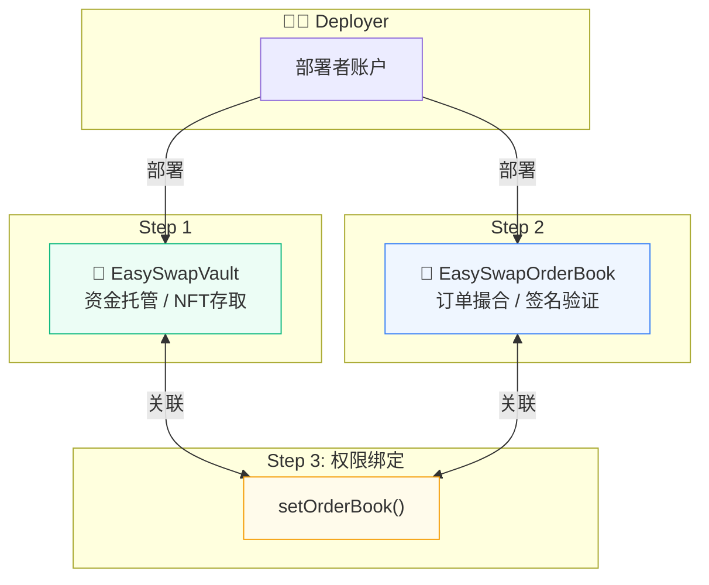
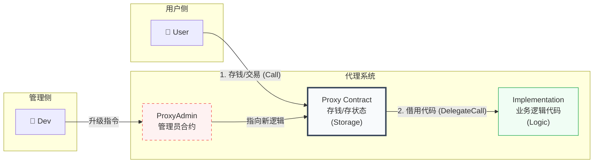
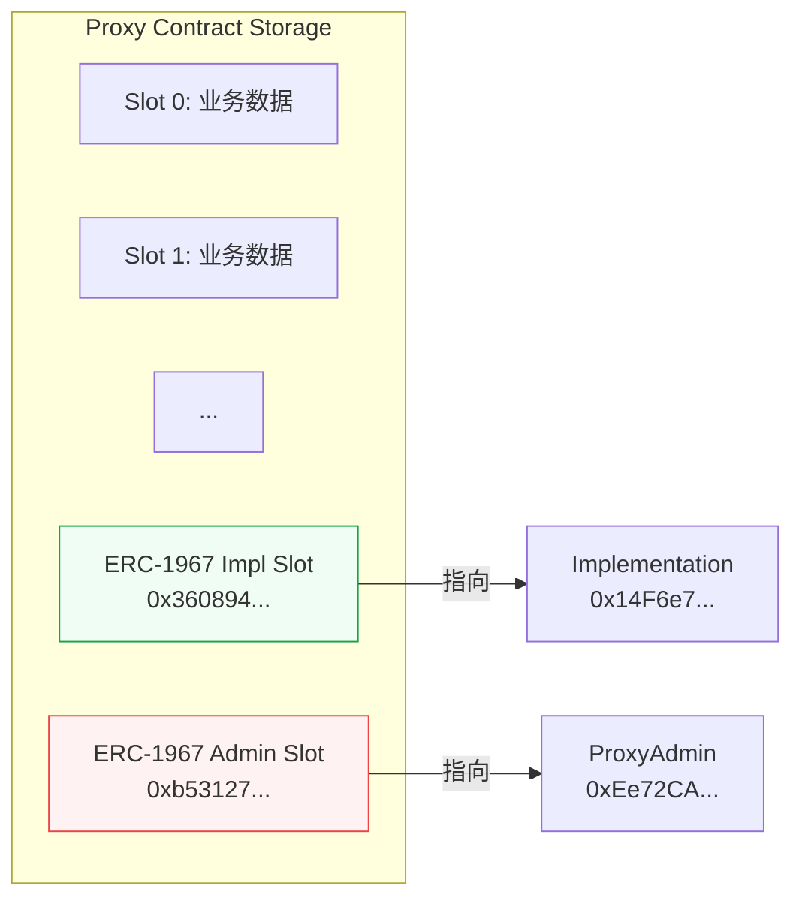
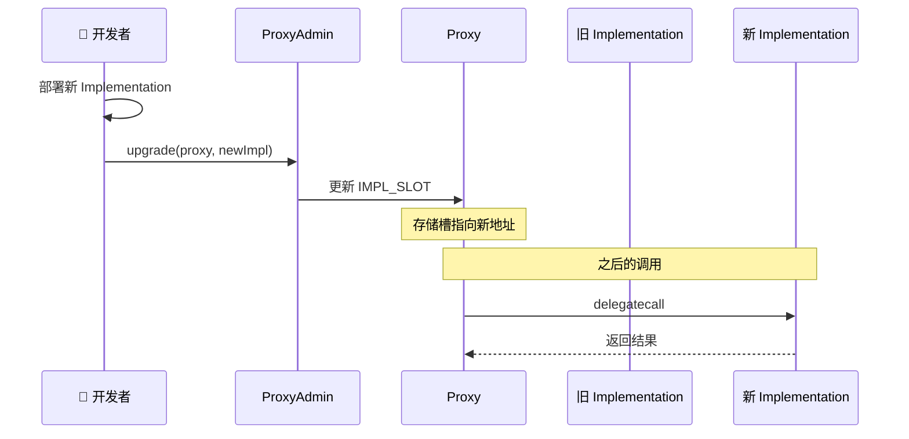

# EasySwap 部署脚本深度解析

> Hardhat + OpenZeppelin Upgrades 自动化部署流程

**目标**：部署一套可升级的 NFT 交易系统，包含资金托管 (Vault) 和订单撮合 (OrderBook) 两个核心组件。

---

## 📊 系统架构图



---

## 🚀 部署步骤详解

### Step 1️⃣：部署 EasySwapVault (金库)

```javascript
let esVault = await ethers.getContractFactory("EasySwapVault")
esVault = await upgrades.deployProxy(esVault, {
  initializer: 'initialize' // 代理模式不使用 constructor
});
await esVault.deployed()
```

| 要点 | 说明 |
|:---|:---|
| `getContractFactory` | 从编译产物 (artifacts) 加载合约 ABI 和字节码 |
| `deployProxy` | 使用 OpenZeppelin 的代理模式部署 |
| `initializer` | 指定初始化函数（替代 constructor）|

---

### Step 2️⃣：部署 EasySwapOrderBook (撮合引擎)

```javascript
const params = [
  newProtocolShare,     // 协议费 200 = 2%
  esVault.address,      // 金库地址
  EIP712Name,           // "EasySwapOrderBook"
  EIP712Version         // "1"
];

esDex = await upgrades.deployProxy(esDex, params, { 
  initializer: 'initialize',
  unsafeAllow: ['state-variable-immutable']  // 允许 immutable 变量
});
```

| 参数 | 值 | 说明 |
|:---|:---|:---|
| `protocolShare` | 200 | 协议费 2% (200/10000) |
| `vault` | Vault 地址 | 资产托管合约 |
| `EIP712Name` | "EasySwapOrderBook" | 链下签名域名 |
| `EIP712Version` | "1" | 签名版本 |

---

### Step 3️⃣：关键步骤 - 权限绑定

```javascript
// 告诉金库："只有这个 OrderBook 能动你的钱"
await esVault_.setOrderBook(esDexAddress);
```

> ⚠️ **重要**：如果不执行这一步，OrderBook 无法操作 Vault 中的资产！

---

## 🏗️ 核心架构：代理模式铁三角



---

### 三大角色解析

| 角色 | 职责 | 说明 |
|:---|:---|:---|
| **Proxy (前台)** | "我负责收钱和记账" | 用户的资产和数据都在这里。通过 `delegatecall` 借用 Implementation 的脑子处理数据。**地址永远不变**。 |
| **Implementation (大脑)** | "我负责思考" | 存放实际的 Solidity 代码。Proxy 把数据传过来，计算完后写回 Proxy。**升级就是换掉这个合约**。 |
| **ProxyAdmin (管理员)** | "我负责换大脑" | Proxy 的唯一管理员。只有它能调用升级函数。防止普通用户意外触发升级逻辑（函数选择器冲突）。 |

---

### 为什么需要 ProxyAdmin？

```
问题：如果 Proxy 自己管理升级，可能发生函数选择器冲突

例如：
- 业务函数 transfer() 的选择器 = 0xa9059cbb
- 升级函数 upgrade()  的选择器 = 0xa9059cbb (假设冲突)

用户调用 transfer() 时，可能意外触发 upgrade()！

解决方案：
把升级权限分离给 ProxyAdmin
- 普通用户调用 → 执行业务逻辑
- ProxyAdmin 调用 → 执行升级逻辑
```

---

## 📦 ERC-1967 存储槽

代理合约使用特殊的存储槽位存储关键地址：

```solidity
// Implementation 地址存储位置
bytes32 IMPLEMENTATION_SLOT = 0x360894a13ba1a3210667c828492db98dca3e2076cc3735a920a3ca505d382bbc

// Admin 地址存储位置
bytes32 ADMIN_SLOT = 0xb53127684a568b3173ae13b9f8a6016e243e63b6e8ee1178d6a717850b5d6103
```



---

## ✅ 部署结果

| 合约 | 类型 | 地址 |
|:---|:---|:---|
| EasySwapVault | Proxy | `0x38FfF9035b68452507566612445BFf218e83D2d1` |
| EasySwapVault | Implementation | `0x4a3dcf4905cBC596270a339Ce6625f567da0A80E` |
| EasySwapOrderBook | Proxy | `0xDf4c2715AeB20bAe0490b0e4642C7C838c2E0090` |
| EasySwapOrderBook | Implementation | `0x14F6e788dAb429EeE3474d307Eda1B03650822ab` |
| ProxyAdmin | - | `0xEe72CA76455dAdf967306da7d214B1F1520F1a40` |

---

## 🔄 升级流程



---

> 📝 **文档版本**: v1.0  
> 📅 **更新日期**: 2026-02-09
