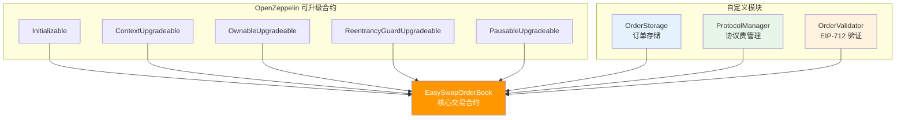
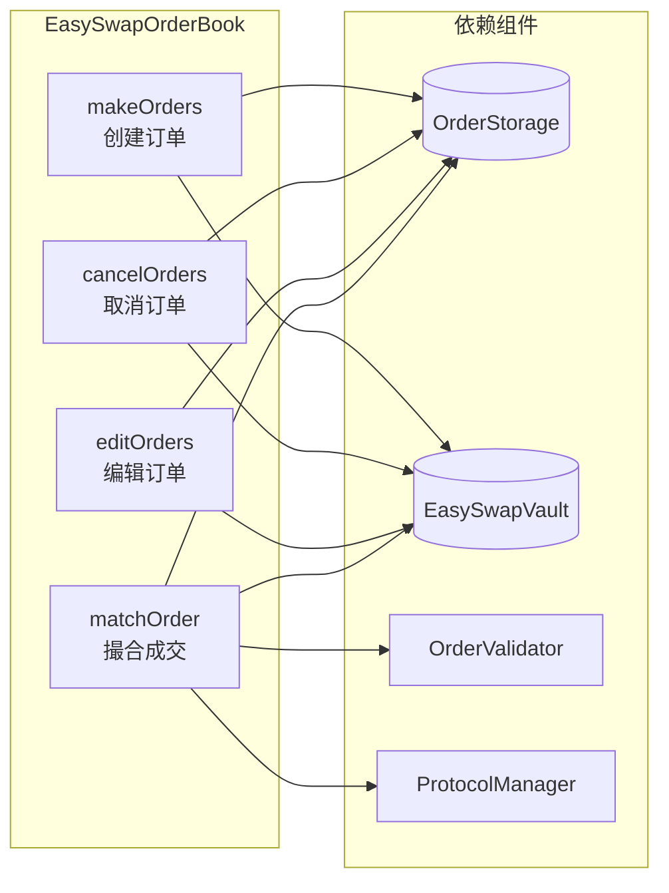
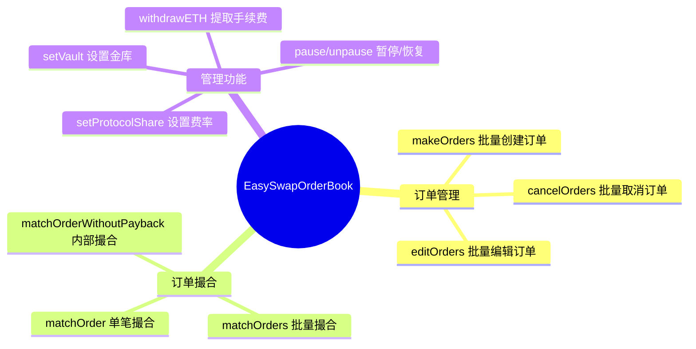
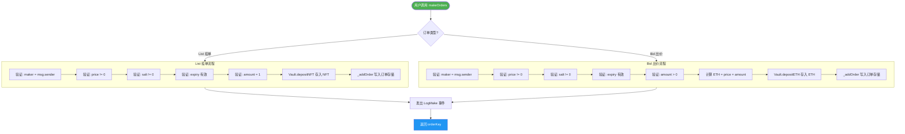
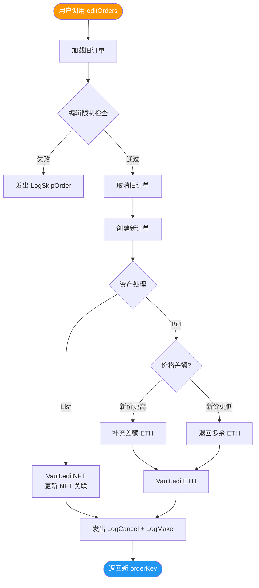
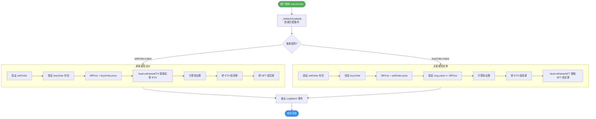
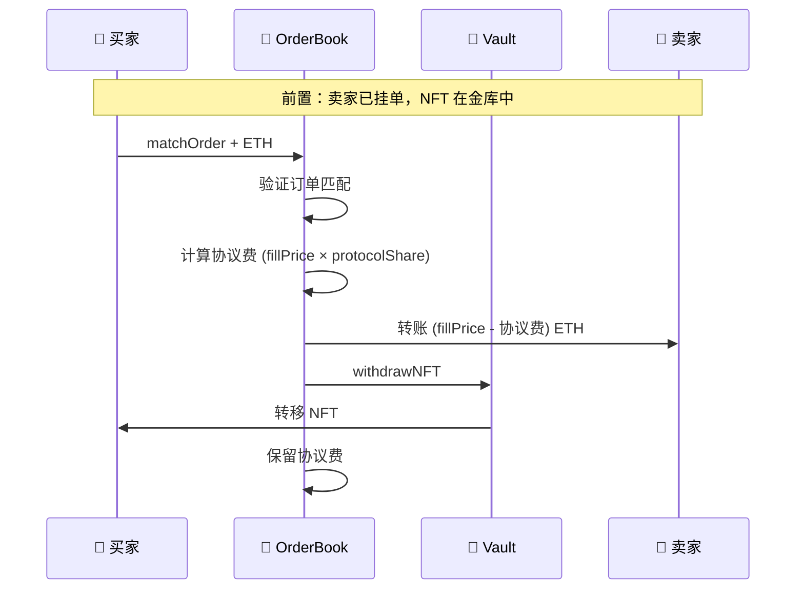
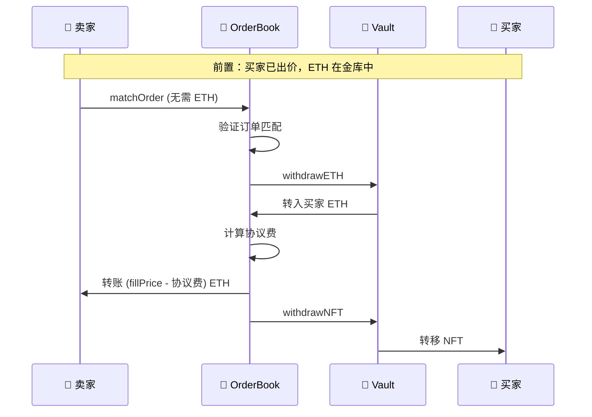
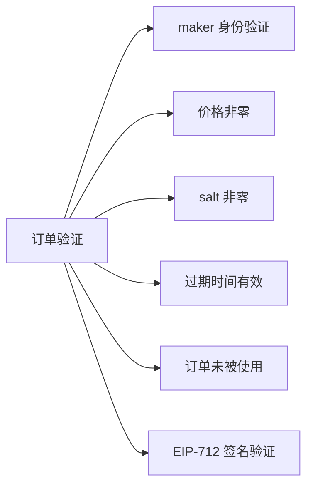
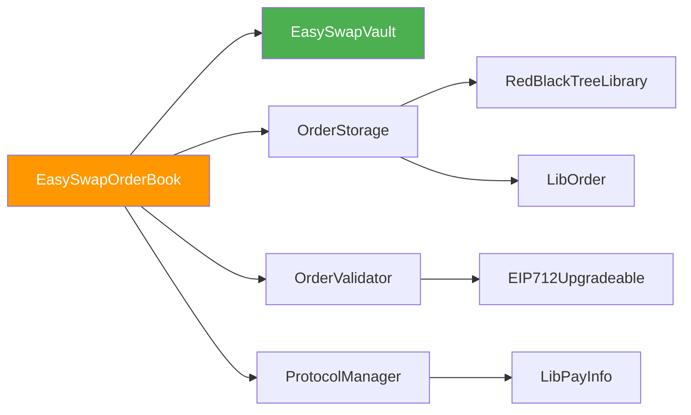

# EasySwapOrderBook 合约解析

> 本文档对 `EasySwapOrderBook.sol` 核心交易合约进行详细解析，包括合约结构、核心功能、业务流程等可视化说明。

---

## 📊 合约概览

`EasySwapOrderBook` 是 NFT 订单簿交易系统的**核心合约**，负责订单的创建、取消、编辑和撮合成交。

### 合约继承结构



---

## 🏗️ 核心组件

| 组件 | 职责 | 关键功能 |
|:---|:---|:---|
| **OrderStorage** | 订单存储 | 红黑树价格排序、链表时间优先 |
| **ProtocolManager** | 协议费管理 | 设置/计算手续费比例 |
| **OrderValidator** | 签名验证 | EIP-712 签名校验、订单状态验证 |
| **EasySwapVault** | 资产托管 | NFT 和 ETH 存取管理 |

### 组件交互关系



---

## 📋 核心函数一览



---

## 🔄 核心业务流程

### 1️⃣ 创建订单 (makeOrders)



### 验证规则

| 条件 | 说明 |
|:---|:---|
| `order.maker == msg.sender` | 只能为自己创建订单 |
| `order.price != 0` | 价格不能为零 |
| `order.salt != 0` | 随机数防重放 |
| `order.expiry > block.timestamp` 或 `== 0` | 过期时间有效或永不过期 |
| `filledAmount[orderKey] == 0` | 订单未被取消或成交过 |

---

### 2️⃣ 取消订单 (cancelOrders)

```mermaid
flowchart TB
    START([用户调用 cancelOrders]) --> LOAD[加载订单: orders[orderKey]]
    LOAD --> CHECK{验证条件}
    
    CHECK -->|失败| SKIP[发出 LogSkipOrder 事件]
    CHECK -->|通过| TYPE{订单类型?}
    
    TYPE -->|List| LIST_CANCEL
    TYPE -->|Bid| BID_CANCEL
    
    subgraph LIST_CANCEL [List 取消流程]
        LC1[_removeOrder 从存储移除]
        LC2[Vault.withdrawNFT 提取 NFT]
        LC3[_cancelOrder 标记取消]
        LC1 --> LC2 --> LC3
    end
    
    subgraph BID_CANCEL [Bid 取消流程]
        BC1[计算未成交数量]
        BC2[_removeOrder 从存储移除]
        BC3[Vault.withdrawETH 提取 ETH]
        BC4[_cancelOrder 标记取消]
        BC1 --> BC2 --> BC3 --> BC4
    end
    
    LIST_CANCEL --> EMIT[发出 LogCancel 事件]
    BID_CANCEL --> EMIT
    EMIT --> DONE([返回 success])
    SKIP --> FAIL([返回 false])
    
    style START fill:#f44336,color:#fff
    style DONE fill:#4caf50,color:#fff
    style FAIL fill:#9e9e9e,color:#fff
```

### 取消条件

```solidity
// 只有满足以下条件才能取消
order.maker == _msgSender() &&           // 只有创建者可以取消
filledAmount[orderKey] < order.nft.amount // 订单未完全成交
```

---

### 3️⃣ 编辑订单 (editOrders)



### 编辑限制

| 可修改 | 不可修改 |
|:---|:---|
| ✅ price 价格 | ❌ saleKind 销售类型 |
| ✅ amount 数量 | ❌ side 订单方向 |
| ✅ expiry 过期时间 | ❌ maker 创建者 |
| ✅ salt 随机数 | ❌ collection 合约地址 |
| | ❌ tokenId |

---

### 4️⃣ 撮合成交 (matchOrder)



### 匹配条件 (_isMatchAvailable)

```solidity
sellOrderKey != buyOrderKey        // 不能是同一订单
sellOrder.side == Side.List        // 卖单必须是 List
buyOrder.side == Side.Bid          // 买单必须是 Bid
sellOrder.maker != buyOrder.maker  // 买卖双方不能是同一人
// 资产匹配：Collection Bid 或 tokenId 相同
buyOrder.saleKind == FixedPriceForCollection || 
    (collection 和 tokenId 相同)
// 订单未完全成交
filledAmount[sellOrderKey] < sellOrder.nft.amount
filledAmount[buyOrderKey] < buyOrder.nft.amount
```

---

## 💰 资金流转

### 买家购买 NFT (List → Buy)



### 卖家接受出价 (Bid → Accept)



---

## 🔐 安全机制

### 1. 重入保护

```solidity
modifier nonReentrant {
    // OpenZeppelin ReentrancyGuard
    // 防止在函数执行期间重复调用
}
```

### 2. 暂停机制

```solidity
modifier whenNotPaused {
    // 合约可被 Owner 暂停
    // 紧急情况下停止所有交易
}
```

### 3. DelegateCall 限制

```solidity
modifier onlyDelegateCall {
    require(address(this) != self);
    // 只允许通过 delegatecall 调用
    // 用于批量撮合的原子性
}
```

### 4. 订单验证



---

## 📊 事件 (Events)

| 事件 | 触发时机 | 关键参数 |
|:---|:---|:---|
| `LogMake` | 订单创建成功 | orderKey, side, maker, price, nft |
| `LogCancel` | 订单取消成功 | orderKey, maker |
| `LogMatch` | 订单撮合成功 | sellOrderKey, buyOrderKey, fillPrice |
| `LogSkipOrder` | 订单操作跳过 | orderKey, salt |
| `BatchMatchInnerError` | 批量撮合错误 | offset, msg |
| `LogWithdrawETH` | 提取 ETH | recipient, amount |

---

## 🔧 管理功能

| 函数 | 权限 | 功能 |
|:---|:---|:---|
| `setVault` | onlyOwner | 设置金库合约地址 |
| `setProtocolShare` | onlyOwner | 设置协议费比例 |
| `withdrawETH` | onlyOwner | 提取协议手续费 |
| `pause` | onlyOwner | 暂停合约交易 |
| `unpause` | onlyOwner | 恢复合约交易 |

---

## 📈 Gas 优化

1. **批量操作**：`makeOrders`, `cancelOrders`, `editOrders`, `matchOrders` 支持批量处理
2. **Try 模式**：单个订单失败不影响批量中其他订单
3. **DelegateCall 批量撮合**：`matchOrders` 使用 delegatecall 避免多次退款
4. **存储间隙**：预留 50 个 slot 用于未来升级

---

## 🔗 合约依赖



---

> 📝 **文档版本**: v1.0  
> 📅 **更新日期**: 2026-02-08  
> 📁 **源文件**: [EasySwapOrderBook.sol](./EasySwapContract/contracts/EasySwapOrderBook.sol)
