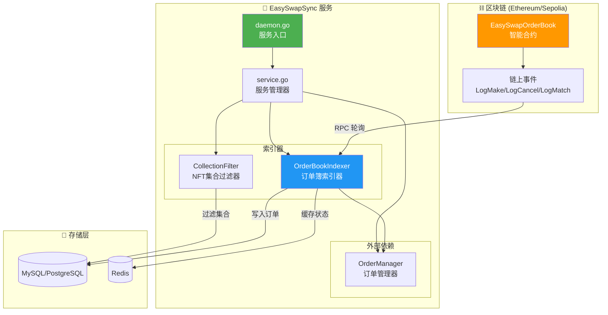
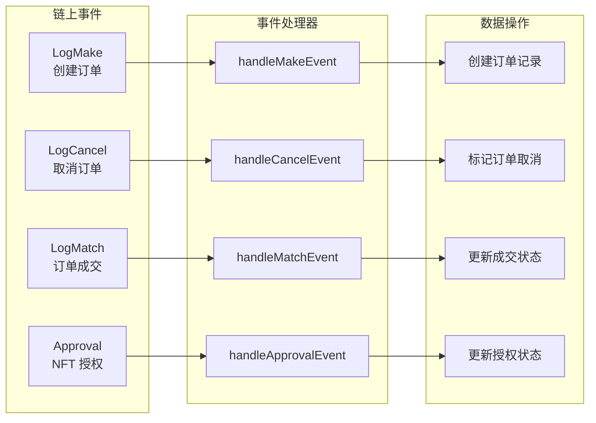
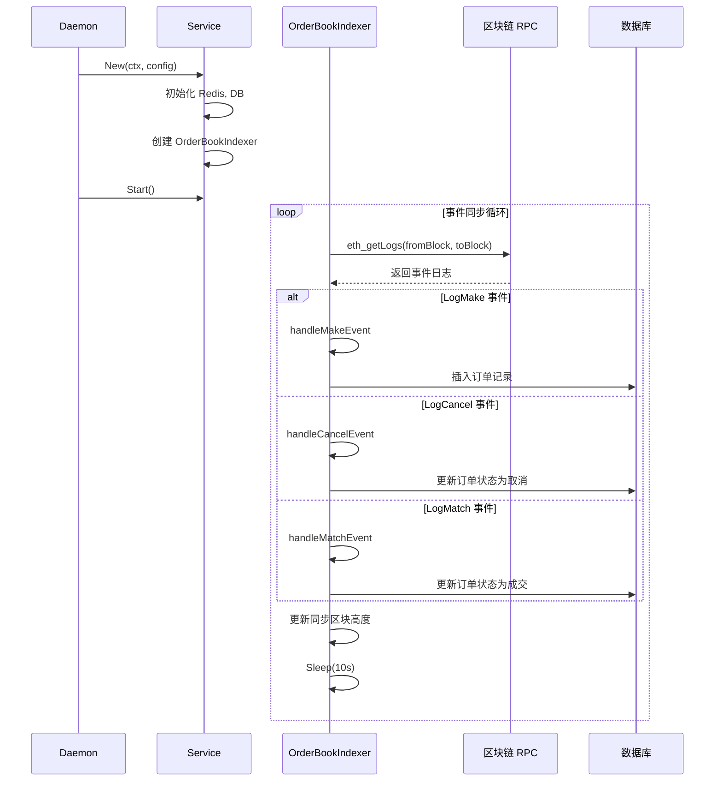
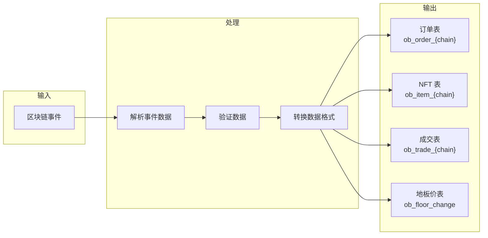
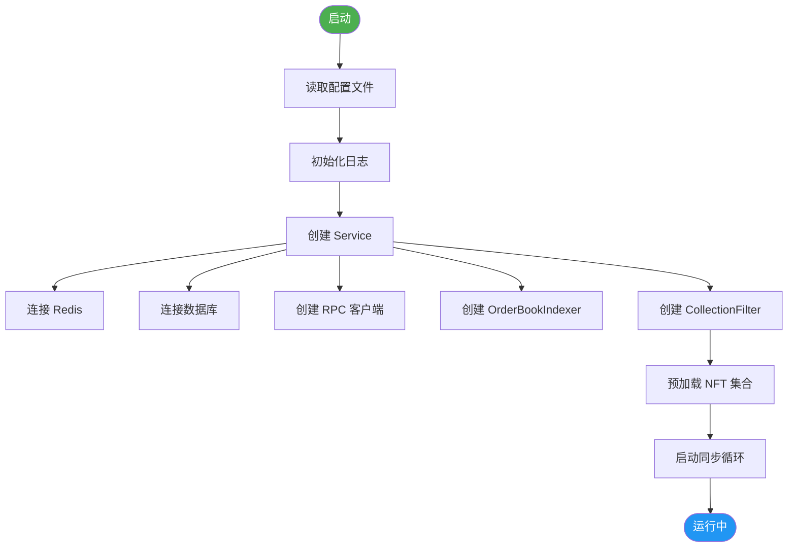
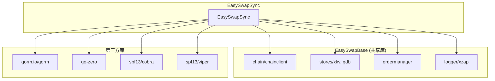
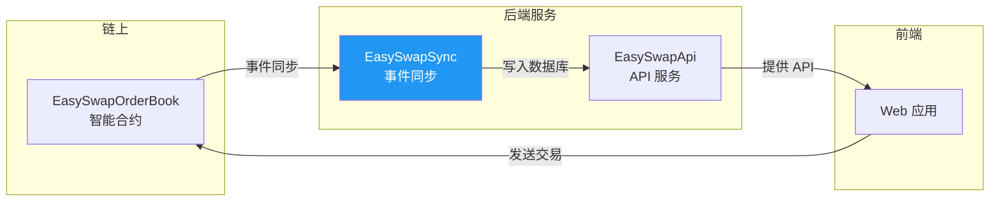

# EasySwapSync 架构解析

> 链上事件同步服务：将智能合约事件实时同步到数据库，支持订单状态管理和地板价追踪。

---

## 📊 整体架构图



---

## 🏗️ 目录结构

```
EasySwapSync/
├── main.go                    # 程序入口
├── cmd/
│   ├── root.go               # Cobra 根命令
│   └── daemon.go             # daemon 子命令（主服务）
├── config/
│   └── config.toml           # 配置文件
├── service/
│   ├── service.go            # 服务管理器（核心）
│   ├── config/
│   │   └── config.go         # 配置结构定义
│   ├── orderbookindexer/
│   │   └── service.go        # 订单簿索引器（1300+行，核心逻辑）
│   ├── collectionfilter/
│   │   └── filter.go         # NFT 集合过滤器
│   └── comm/
│       ├── types.go          # 公共类型定义
│       └── util/             # 工具函数
├── model/
│   └── db.go                 # 数据库初始化
└── db/
    └── migrations/           # 数据库迁移
```

---

## 🔧 核心组件

### 1️⃣ Service (服务管理器)

```go
type Service struct {
    ctx              context.Context
    config           *config.Config
    kvStore          *xkv.Store           // Redis 缓存
    db               *gorm.DB             // 数据库
    collectionFilter *collectionfilter.Filter  // 集合过滤器
    orderbookIndexer *orderbookindexer.Service // 订单簿索引器
    orderManager     *ordermanager.OrderManager // 订单管理器
}
```

| 组件 | 职责 |
|:---|:---|
| **kvStore** | Redis 缓存，存储订单状态和地板价 |
| **db** | 数据库连接，持久化订单数据 |
| **collectionFilter** | 过滤需要追踪的 NFT 集合 |
| **orderbookIndexer** | 监听链上事件，同步订单数据 |
| **orderManager** | 管理订单生命周期 |

---

### 2️⃣ OrderBookIndexer (订单簿索引器)

**核心职责**：监听链上事件，解析并同步到数据库



#### 事件 Topic

```go
const (
    LogMakeTopic        = "0xfc37f2ff..."  // 创建订单
    LogCancelTopic      = "0x5152abd..."   // 取消订单
    LogMatchTopic       = "0xf629aec..."   // 订单成交
    ERC721ApprovalTopic = "0x8c5be1e..."   // NFT 授权
)
```

---

### 3️⃣ CollectionFilter (集合过滤器)

**职责**：维护需要追踪的 NFT 集合白名单

```go
type Filter struct {
    ctx     context.Context
    db      *gorm.DB
    chain   string
    set     map[string]bool  // 集合地址 -> 是否追踪
    lock    *sync.RWMutex    // 读写锁（并发安全）
}
```

| 方法 | 功能 |
|:---|:---|
| `Add(address)` | 添加集合到白名单 |
| `Remove(address)` | 从白名单移除 |
| `Contains(address)` | 检查是否在白名单 |
| `PreloadCollections()` | 从数据库预加载白名单 |

---

## 🔄 同步流程



---

## ⚙️ 配置结构

```toml
[chain_cfg]
name = "sepolia"
id = 11155111

[contract_cfg]
dex_address = "0xDf4c2715..."    # OrderBook 合约
vault_address = "0x38FfF903..."  # Vault 合约

[ankr_cfg]
https_url = "https://sepolia.infura.io/v3/"
api_key = "your_api_key"

[db]
host = "localhost"
port = 3306
database = "easyswap"

[kv.redis]
host = "localhost:6379"
```

---

## 📊 数据流向



---

## 🔑 关键函数

| 函数 | 文件 | 功能 |
|:---|:---|:---|
| `SyncOrderBookEventLoop` | orderbookindexer/service.go | 主同步循环 |
| `handleMakeEvent` | orderbookindexer/service.go | 处理创建订单事件 |
| `handleCancelEvent` | orderbookindexer/service.go | 处理取消订单事件 |
| `handleMatchEvent` | orderbookindexer/service.go | 处理成交事件 |
| `handleApprovalEvent` | orderbookindexer/service.go | 处理 NFT 授权事件 |
| `checkAndHandleFork` | orderbookindexer/service.go | 处理区块分叉 |
| `UpKeepingCollectionFloorChangeLoop` | orderbookindexer/service.go | 更新地板价 |

---

## 🚀 启动流程



---

## 📋 依赖关系



---

## 🔗 与其他服务的关系



---

> 📝 **文档版本**: v1.0  
> 📅 **更新日期**: 2026-02-09
