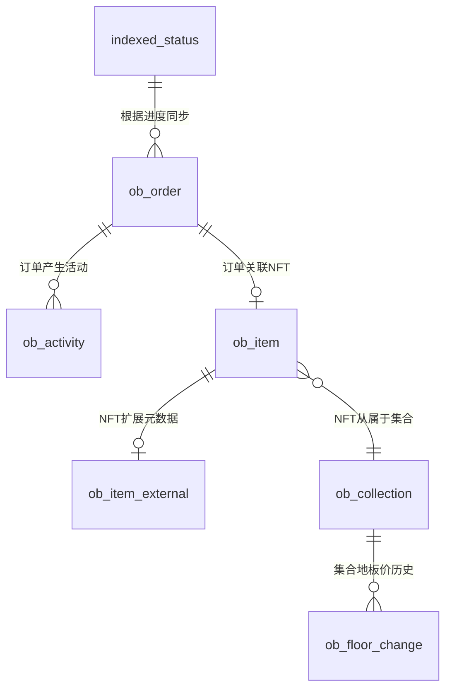
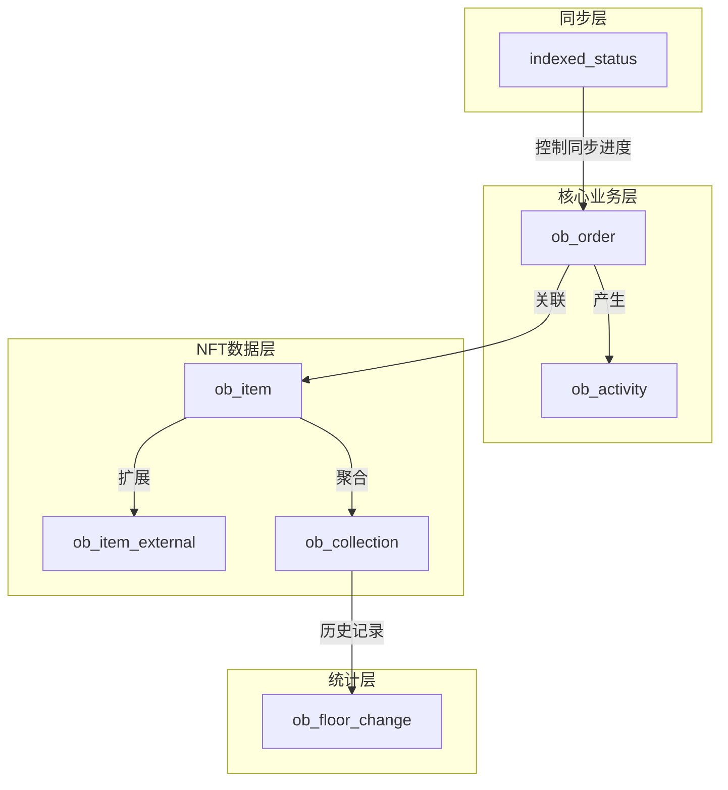
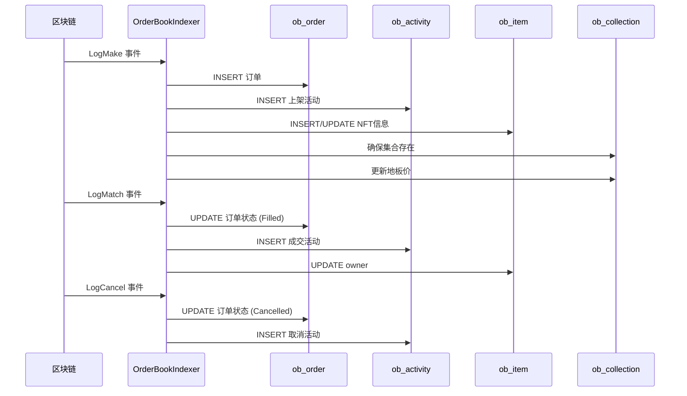

# EasySwapSync 数据库表结构说明

本文档说明 `orderbookindexer/service.go` 涉及的数据库表及其关联关系。

---

## 表概览



---

## 1. indexed_status (同步进度表)

追踪各种同步任务的进度。

| 字段 | 类型 | 说明 |
|:---|:---|:---|
| chain_id | int | 链ID |
| index_type | int | 索引类型 (6=订单簿事件) |
| last_indexed_block | bigint | 最后同步的区块高度 |
| last_indexed_time | bigint | 最后同步时间 |

**用途**：
- `SyncOrderBookEventLoop` 启动时读取 `last_indexed_block`
- 每轮同步后更新 `last_indexed_block`

---

## 2. ob_order_{chain} (订单表)

存储所有挂单信息（Listing/Bid）。

| 字段 | 类型 | 说明 |
|:---|:---|:---|
| order_id | varchar | 订单ID (链上 OrderKey) |
| collection_address | varchar | NFT合约地址 |
| token_id | varchar | Token ID |
| order_type | int | 订单类型: 0=Listing, 1=CollectionBid, 2=ItemBid |
| order_status | int | 状态: 0=Active, 1=Filled, 2=Cancelled, 3=Expired |
| maker | varchar | 挂单者地址 |
| taker | varchar | 成交者地址 |
| price | decimal | 价格 (Wei) |
| currency_address | varchar | 支付代币地址 |
| expire_time | bigint | 过期时间戳 |
| quantity_remaining | int | 剩余可成交数量 |
| size | int | 原始数量 |
| salt | bigint | 随机盐值 |
| marketplace_id | int | 市场ID (=1 表示 OrderBook) |

**操作**：
- `handleMakeEvent`: INSERT
- `handleMatchEvent`: UPDATE (status=Filled, quantity_remaining--)
- `handleCancelEvent`: UPDATE (status=Cancelled)
- `rollbackOrderStatus`: UPDATE (恢复 status=Active)

---

## 3. ob_activity_{chain} (活动表)

记录所有链上活动日志。

| 字段 | 类型 | 说明 |
|:---|:---|:---|
| activity_type | int | 活动类型 (见下表) |
| maker | varchar | 发起者地址 |
| taker | varchar | 接收者地址 |
| collection_address | varchar | NFT合约地址 |
| token_id | varchar | Token ID |
| price | decimal | 价格 |
| currency_address | varchar | 支付代币 |
| block_number | bigint | 区块高度 |
| tx_hash | varchar | 交易哈希 |
| event_time | bigint | 事件时间戳 |
| marketplace_id | int | 市场ID |

**活动类型 (activity_type)**：

| 值 | 常量 | 说明 |
|:---|:---|:---|
| 0 | Listing | 上架 |
| 1 | Sale | 成交 |
| 2 | CancelListing | 取消上架 |
| 3 | CollectionBid | 集合出价 |
| 4 | ItemBid | 单品出价 |
| 5 | CancelCollectionBid | 取消集合出价 |
| 6 | CancelItemBid | 取消单品出价 |

**操作**：
- `handleMakeEvent`: INSERT (Listing/Bid)
- `handleMatchEvent`: INSERT (Sale)
- `handleCancelEvent`: INSERT (Cancel*)
- `checkAndHandleFork`: DELETE (分叉回滚)

---

## 4. ob_item_{chain} (NFT单品表)

存储每个 NFT 的信息。

| 字段 | 类型 | 说明 |
|:---|:---|:---|
| collection_address | varchar | NFT合约地址 |
| token_id | varchar | Token ID |
| owner | varchar | 当前所有者 |
| supply | int | 供应量 (ERC721=1) |
| list_price | decimal | 当前上架价格 |
| list_time | bigint | 上架时间 |
| sale_price | decimal | 最后成交价 |
| update_time | bigint | 更新时间 |

**操作**：
- `handleMakeEvent`: INSERT/UPDATE (新建或更新上架价格)
- `handleMatchEvent`: UPDATE (owner 变更)
- `rollbackOrderStatus`: UPDATE (恢复 owner)

---

## 5. ob_item_external_{chain} (NFT元数据表)

存储 NFT 的扩展元数据（TokenURI、Image 等）。

| 字段 | 类型 | 说明 |
|:---|:---|:---|
| collection_address | varchar | NFT合约地址 |
| token_id | varchar | Token ID |
| meta_data_uri | varchar(512) | TokenURI (元数据链接) |
| image_uri | varchar(512) | 图片链接 |
| oss_uri | varchar | OSS 上传后的链接 |
| is_uploaded_oss | bool | 是否已上传 OSS |
| upload_status | int | 上传状态 |

**操作**：
- `createItemExternal`: INSERT (首次挂单时获取元数据)

---

## 6. ob_collection_{chain} (NFT集合表)

存储 NFT 集合的汇总信息。

| 字段 | 类型 | 说明 |
|:---|:---|:---|
| address | varchar | 合约地址 |
| chain_id | int | 链ID |
| name | varchar | 集合名称 |
| symbol | varchar | 符号 |
| floor_price | decimal | 地板价 |
| owner_amount | int | 持有者数量 |
| item_amount | int | NFT数量 |
| volume_total | decimal | 总交易量 |

**操作**：
- `ensureCollectionExists`: INSERT (首次挂单时创建)
- `updateCollectionFloorPrice`: UPDATE (地板价更新)

---

## 7. ob_floor_change_{chain} (地板价历史表)

记录集合地板价的变化历史。

| 字段 | 类型 | 说明 |
|:---|:---|:---|
| collection_address | varchar | 合约地址 |
| price | decimal | 地板价 |
| event_time | bigint | 记录时间 |

**操作**：
- `persistCollectionsFloorChange`: 批量 INSERT
- `deleteExpireCollectionFloorChangeFromDatabase`: DELETE (清理过期记录)

---

## 表关系图



> **注意**：实际表名带有链后缀，如 `ob_order_eth`、`ob_order_sepolia` 等。

---

## 事件与表操作映射

| 链上事件 | indexed_status | ob_order | ob_activity | ob_item | ob_item_external | ob_collection | ob_floor_change |
|:---|:---:|:---:|:---:|:---:|:---:|:---:|:---:|
| LogMake | ✓ 更新进度 | INSERT | INSERT | INSERT | INSERT | INSERT | - |
| LogMatch | ✓ 更新进度 | UPDATE | INSERT | UPDATE | - | - | - |
| LogCancel | ✓ 更新进度 | UPDATE | INSERT | - | - | - | - |
| 定时任务 | - | - | - | - | - | UPDATE | INSERT |
| 分叉回滚 | - | UPDATE | DELETE | UPDATE | - | - | - |

---

## 关联关系说明

### 主键/唯一索引

| 表 | 主键/唯一索引 |
|:---|:---|
| indexed_status | (chain_id, index_type) |
| ob_order | order_id |
| ob_activity | (tx_hash, activity_type) |
| ob_item | (collection_address, token_id) |
| ob_item_external | (collection_address, token_id) |
| ob_collection | address |
| ob_floor_change | (collection_address, event_time) |

### 外键关系（逻辑外键）

```
ob_order.collection_address → ob_collection.address
ob_order.(collection_address, token_id) → ob_item.(collection_address, token_id)
ob_activity.collection_address → ob_collection.address
ob_item.collection_address → ob_collection.address
ob_item_external.(collection_address, token_id) → ob_item.(collection_address, token_id)
ob_floor_change.collection_address → ob_collection.address
```

---

## 数据流向


