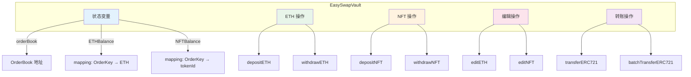
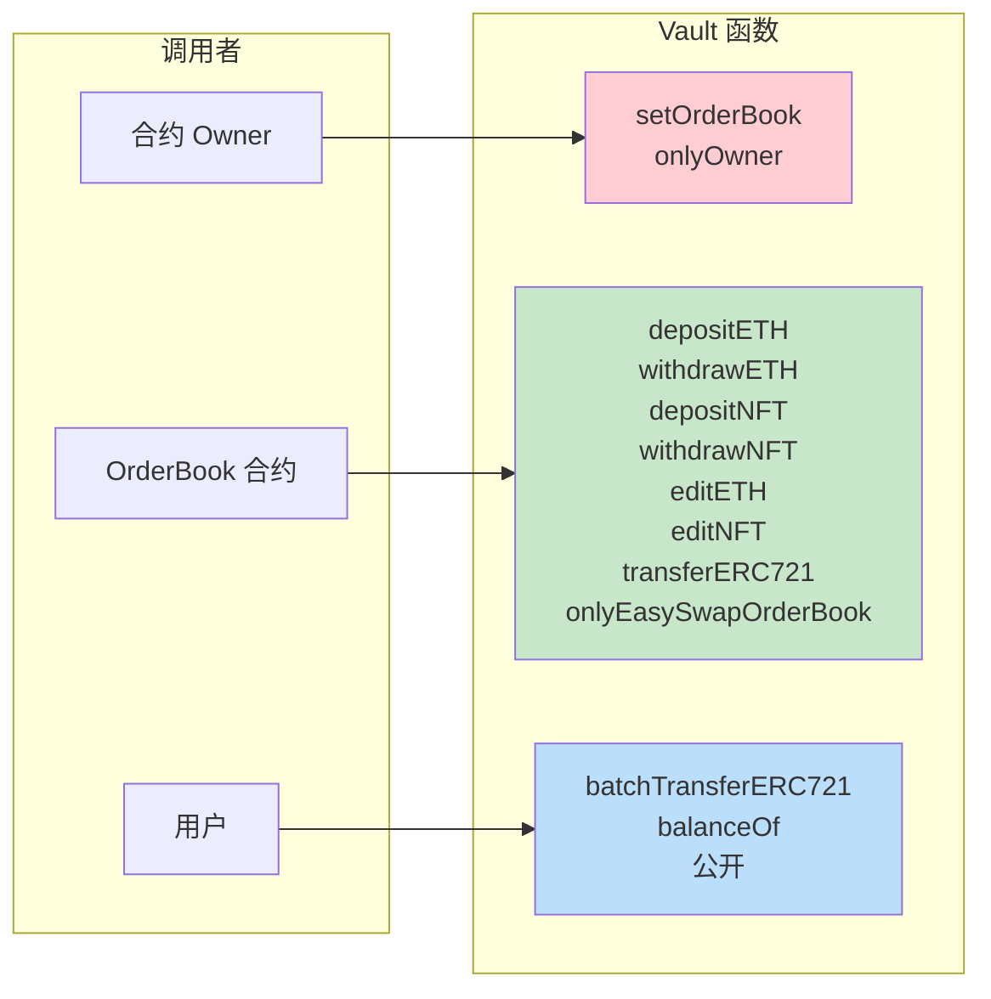
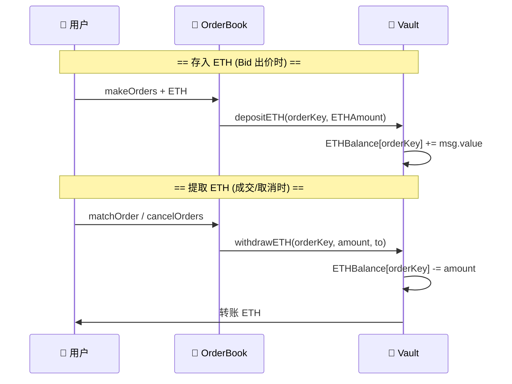
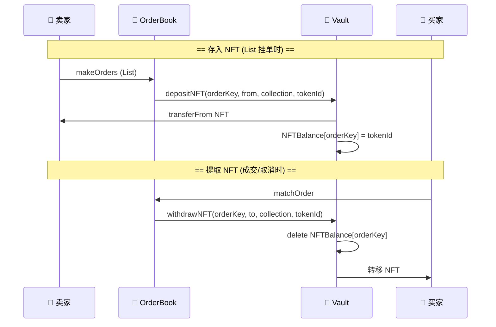
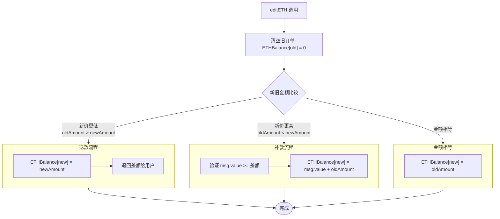
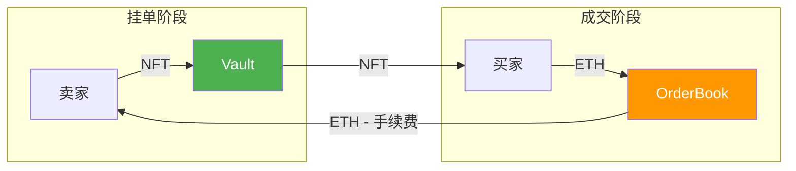
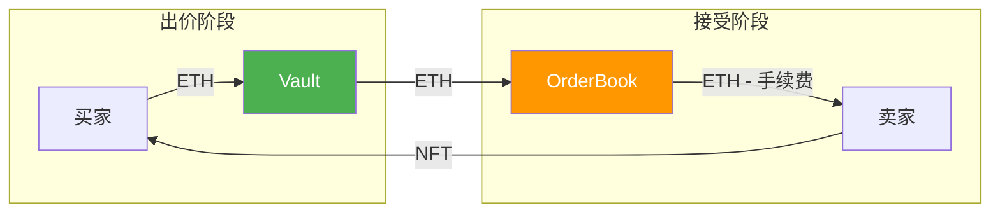

# EasySwapVault 合约解析

> 本文档对 `EasySwapVault.sol` 资产托管合约进行详细解析，包括合约结构、核心功能、资产流转等可视化说明。

---

## 📊 合约概览

`EasySwapVault` 是 NFT 订单簿交易系统的**资产托管合约（金库）**，负责在撮合前/撮合中安全托管用户的 ETH 与 NFT 资产。

### 核心职责

| 职责 | 说明 |
|:---|:---|
| 🔐 **权限隔离** | 仅允许 OrderBook 合约调用存取款 |
| 💰 **ETH 托管** | 按订单维度记录 ETH 余额（Bid 出价锁定） |
| 🖼️ **NFT 托管** | 按订单维度记录 NFT（List 挂单锁定） |
| ✏️ **订单编辑** | 支持改价时资产迁移（editETH/editNFT） |
| 🔄 **资产转移** | 支持直接 NFT 转账和批量转账 |

---

## 🏗️ 合约结构



---

## 🔐 权限控制



### 权限修饰符

```solidity
modifier onlyEasySwapOrderBook() {
    require(msg.sender == orderBook, "HV: only EasySwap OrderBook");
    _;
}
```

> ⚠️ 只有 OrderBook 合约可以操作托管资产，防止资产被任意转出。

---

## 💰 ETH 操作

### 数据结构

```solidity
// 按订单维度托管的 ETH 数量
mapping(OrderKey => uint256) public ETHBalance;
```

### 存取流程



### depositETH

```solidity
function depositETH(OrderKey orderKey, uint256 ETHAmount) external payable onlyEasySwapOrderBook {
    require(msg.value >= ETHAmount, "HV: not match ETHAmount");
    ETHBalance[orderKey] += msg.value;
}
```

| 参数 | 说明 |
|:---|:---|
| `orderKey` | 订单唯一标识 |
| `ETHAmount` | 预期存入金额 |
| `msg.value` | 实际发送的 ETH |

### withdrawETH

```solidity
function withdrawETH(OrderKey orderKey, uint256 ETHAmount, address to) external onlyEasySwapOrderBook {
    ETHBalance[orderKey] -= ETHAmount;
    to.safeTransferETH(ETHAmount);
}
```

| 场景 | to 地址 |
|:---|:---|
| Bid 成交 → 卖家收款 | 卖家地址 |
| Bid 取消 → 退还买家 | 买家地址 |
| Bid 成交 → 协议费 | OrderBook 合约 |

---

## 🖼️ NFT 操作

### 数据结构

```solidity
// 按订单维度托管的 NFT tokenId
mapping(OrderKey => uint256) public NFTBalance;
```

### 存取流程



### depositNFT

```solidity
function depositNFT(
    OrderKey orderKey,
    address from,
    address collection,
    uint256 tokenId
) external onlyEasySwapOrderBook {
    IERC721(collection).safeTransferNFT(from, address(this), tokenId);
    NFTBalance[orderKey] = tokenId;
}
```

> 📌 前提：卖家需要先 `approve` Vault 合约

### withdrawNFT

```solidity
function withdrawNFT(
    OrderKey orderKey,
    address to,
    address collection,
    uint256 tokenId
) external onlyEasySwapOrderBook {
    require(NFTBalance[orderKey] == tokenId, "HV: not match tokenId");
    delete NFTBalance[orderKey];
    IERC721(collection).safeTransferNFT(address(this), to, tokenId);
}
```

| 场景 | to 地址 |
|:---|:---|
| List 成交 → 买家获得 NFT | 买家地址 |
| List 取消 → 退还卖家 NFT | 卖家地址 |

---

## ✏️ 编辑操作

### editETH - ETH 迁移

订单编辑时，将 ETH 从旧订单迁移到新订单：



### 示例

| 场景 | 旧价格 | 新价格 | 操作 |
|:---|:---|:---|:---|
| 提高出价 | 1 ETH | 1.5 ETH | 用户补充 0.5 ETH |
| 降低出价 | 1 ETH | 0.8 ETH | 退还用户 0.2 ETH |
| 价格不变 | 1 ETH | 1 ETH | 仅迁移记录 |

### editNFT - NFT 迁移

订单编辑时，将 NFT 记录从旧订单迁移到新订单（NFT 本身不移动）：

```solidity
function editNFT(OrderKey oldOrderKey, OrderKey newOrderKey) external onlyEasySwapOrderBook {
    NFTBalance[newOrderKey] = NFTBalance[oldOrderKey];
    delete NFTBalance[oldOrderKey];
}
```

```
旧订单                    新订单
┌─────────────────┐      ┌─────────────────┐
│ oldOrderKey     │ ──▶  │ newOrderKey     │
│ tokenId: 42     │      │ tokenId: 42     │
└─────────────────┘      └─────────────────┘
      ❌ 删除                  ✅ 新增
      
      NFT 本身位置不变，只是关联到新的 orderKey
```

---

## 🔄 转账操作

### transferERC721 - 单笔转账

OrderBook 发起的 NFT 直接转账（如卖家接受 Bid 时，NFT 不在 Vault 中）：

```solidity
function transferERC721(address from, address to, LibOrder.Asset calldata assets) 
    external onlyEasySwapOrderBook {
    IERC721(assets.collection).safeTransferNFT(from, to, assets.tokenId);
}
```

### batchTransferERC721 - 批量转账

用户批量转移 NFT（公开函数，任何人可调用）：

```solidity
function batchTransferERC721(address to, LibOrder.NFTInfo[] calldata assets) external {
    for (uint256 i = 0; i < assets.length; ++i) {
        IERC721(assets[i].collection).safeTransferNFT(_msgSender(), to, assets[i].tokenId);
    }
}
```

> 💡 常用于批量上架时一次性将多个 NFT 转入 Vault

---

## 📊 完整资产流转

### List 挂单 → 成交



### Bid 出价 → 接受



---

## 🔧 其他功能

### onERC721Received

```solidity
function onERC721Received(address, address, uint256, bytes memory) public virtual returns (bytes4) {
    return this.onERC721Received.selector;
}
```

> 实现 ERC721 接收接口，使 Vault 能接收 `safeTransferFrom` 的 NFT

### receive

```solidity
receive() external payable {}
```

> 允许合约直接接收 ETH

### __gap

```solidity
uint256[50] private __gap;
```

> 可升级合约的存储间隙，为未来升级预留空间

---

## 📋 函数一览表

| 函数 | 权限 | 功能 |
|:---|:---|:---|
| `setOrderBook` | onlyOwner | 设置 OrderBook 地址 |
| `balanceOf` | 公开 | 查询订单托管余额 |
| `depositETH` | onlyOrderBook | 存入 ETH |
| `withdrawETH` | onlyOrderBook | 提取 ETH |
| `depositNFT` | onlyOrderBook | 存入 NFT |
| `withdrawNFT` | onlyOrderBook | 提取 NFT |
| `editETH` | onlyOrderBook | 编辑订单时迁移 ETH |
| `editNFT` | onlyOrderBook | 编辑订单时迁移 NFT |
| `transferERC721` | onlyOrderBook | 单笔 NFT 转账 |
| `batchTransferERC721` | 公开 | 批量 NFT 转账 |

---

## 🔐 安全设计

| 设计 | 说明 |
|:---|:---|
| **权限隔离** | 只有 OrderBook 可操作托管资产 |
| **按订单隔离** | 每个订单的资产独立记录，互不影响 |
| **安全转账** | 使用 safeTransferETH 和 safeTransferNFT |
| **可升级** | 预留 50 个存储槽位 |

---

> 📝 **文档版本**: v1.0  
> 📅 **更新日期**: 2026-02-09  
> 📁 **源文件**: [EasySwapVault.sol](./EasySwapContract/contracts/EasySwapVault.sol)
