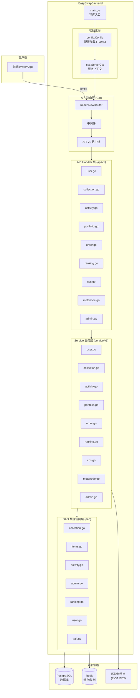
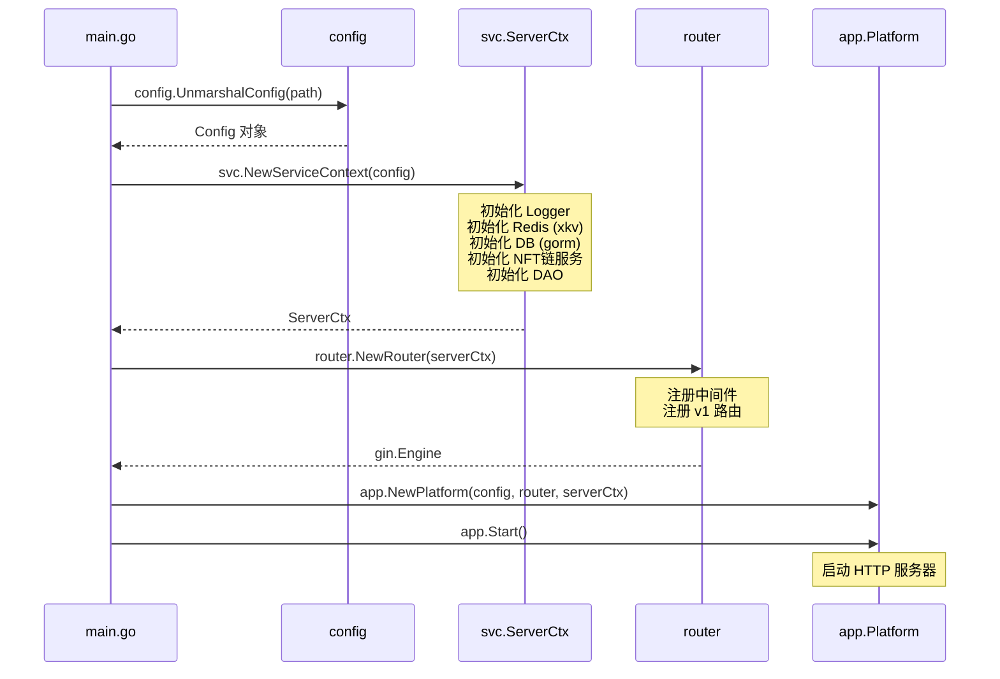
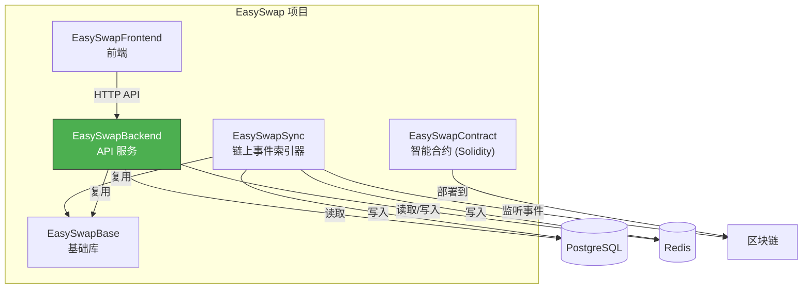

# EasySwapBackend 架构文档

## 一、项目概览

EasySwapBackend 是 EasySwap NFT 市场的后端 API 服务，基于 **Gin** 框架构建，采用经典的分层架构（API → Service → DAO），为前端提供 RESTful 接口。

---

## 二、整体架构图



---

## 三、启动流程



---

## 四、核心组件

### 4.1 服务上下文 (ServerCtx)

所有组件的"粘合剂"，在启动时创建，贯穿整个请求生命周期：

| 字段 | 类型 | 说明 |
|------|------|------|
| `C` | `*config.Config` | 全局配置 |
| `DB` | `*gorm.DB` | 数据库连接 |
| `Dao` | `*dao.Dao` | 数据访问对象 |
| `KvStore` | `*xkv.Store` | Redis 缓存 |
| `NodeSrvs` | `map[int64]*nftchainservice.Service` | 多链 NFT 链上服务 |

### 4.2 中间件 (Middleware)

| 文件 | 功能 |
|------|------|
| `auth.go` | 签名认证，验证用户身份 |
| `cacheapi.go` | API 响应缓存，减少重复查询 |
| `logger.go` | 请求日志记录 |
| `recover.go` | panic 恢复，防止服务崩溃 |

### 4.3 API 路由总览

```mermaid
graph LR
    subgraph "/api/v1"
        U["/user"] --> U1["POST /login"]
        U --> U2["GET /:address/login-message"]
        U --> U3["GET /:address/sig-status"]

        C["/collections"] --> C1["GET /ranking"]
        C --> C2["GET /:address"]
        C --> C3["GET /:address/items"]
        C --> C4["GET /:address/bids"]
        C --> C5["GET /:address/:token_id"]
        C --> C6["POST /:address/mint 🔒"]

        A["/activities"] --> A1["GET /"]

        P["/portfolio"] --> P1["GET /collections"]
        P --> P2["GET /items"]
        P --> P3["GET /listings"]
        P --> P4["GET /bids"]

        O["/bid-orders"] --> O1["GET /"]

        UP["/upload"] --> UP1["POST /cos-token"]
        UP --> UP2["GET /cos-policy 🔒"]

        MN["/metanode"] --> MN1["POST /mint"]
        MN --> MN2["POST /batch-mint"]
        MN --> MN3["GET /query"]

        AD["/admin 🔒"] --> AD1["contracts CRUD"]
        AD --> AD2["nft-import 同步"]
        AD --> AD3["system 管理"]
    end
```



> 🔒 = 需要认证

---

## 五、分层架构详解

### 请求处理流程

```
HTTP Request
  → Gin Router (路由匹配)
    → Middleware (认证/缓存/日志/恢复)
      → API Handler (参数解析、响应格式化)
        → Service (业务逻辑)
          → DAO (数据库操作)
            → PostgreSQL / Redis
```

### 各层职责

| 层级 | 目录 | 职责 |
|------|------|------|
| **路由层** | `api/router/` | URL 路由映射、中间件挂载 |
| **处理层** | `api/v1/` | 解析请求参数、调用 Service、返回 JSON 响应 |
| **业务层** | `service/v1/` | 核心业务逻辑、跨 DAO 协调、链上交互 |
| **数据层** | `dao/` | SQL 查询、Redis 操作、数据模型映射 |
| **类型层** | `types/v1/` | Request/Response 结构体定义 |

---

## 六、核心业务模块

| 模块 | 功能说明 |
|------|----------|
| **User** | 钱包签名登录、登录消息生成 |
| **Collection** | NFT 集合详情、Bids 查询、历史销售 |
| **Items** | NFT 单品详情、Traits、Owner、元数据刷新 |
| **Activity** | 多链交易活动记录查询 |
| **Portfolio** | 用户资产组合（持有的集合、NFT、挂单、出价） |
| **Order** | Bid 订单查询 |
| **Ranking** | 集合排行榜（缓存 60s） |
| **COS** | 腾讯云对象存储上传（临时凭证、策略、回调） |
| **MetaNode** | NFT 铸造服务（单个/批量铸造、查询） |
| **Admin** | 管理后台（合约管理、NFT 导入同步、系统统计） |

---

## 七、与其他模块关系



**数据流向**：
1. **写入方向**：`EasySwapSync` 从区块链同步事件 → 写入 DB 和 Redis
2. **读取方向**：`EasySwapBackend` 从 DB/Redis 读取数据 → 通过 API 返回给前端
3. **共享基础**：两者都依赖 `EasySwapBase` 提供的数据模型和工具库
