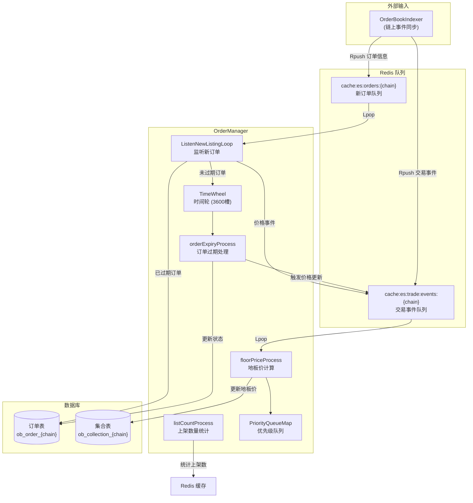
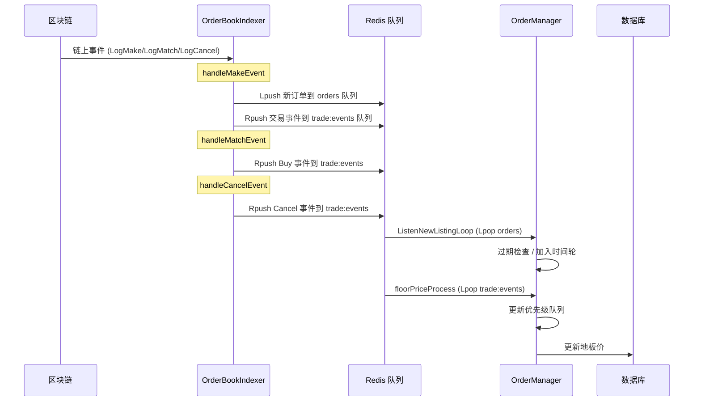

# OrderManager 订单管理核心模块

## 一、模块概览

OrderManager 是 EasySwap 的核心后台组件，负责：
1. **订单过期管理** — 基于时间轮算法自动过期订单
2. **地板价维护** — 实时计算和更新每个 NFT 集合的最低挂单价
3. **上架数量统计** — 定时统计每个集合的 NFT 上架数量

---

## 二、文件结构与重要度

| 文件 | 重要度 | 核心职责 |
|------|--------|----------|
| `service.go` | ⭐⭐⭐ | 入口：结构体定义、启动 4 个协程、Redis 队列监听 |
| `floorprice.go` | ⭐⭐⭐⭐⭐ | 核心！地板价计算和更新逻辑 |
| `expiredorder.go` | ⭐⭐⭐⭐ | 时间轮实现，订单过期检查 |
| `queue.go` | ⭐⭐⭐ | 优先级队列，维护价格排序 |
| `listcount.go` | ⭐⭐ | 集合上架数量统计 |

---

## 三、架构图



---

## 四、四大协程详解

### 4.1 `ListenNewListingLoop` — 新订单监听

**文件**: `service.go`

**流程**:
```
Redis Lpop(cache:es:orders:{chain}) → 解析 ListingInfo
  ├── 已过期? → 更新 DB 状态为 Expired + 触发地板价更新
  └── 未过期? → 触发地板价更新 + 加入时间轮等待过期
```

**关键数据结构**:
```go
type ListingInfo struct {
    ExpireIn       int64           // 过期时间戳
    OrderId        string          // 订单 ID
    CollectionAddr string          // NFT 集合地址
    TokenID        string          // Token ID
    Price          decimal.Decimal // 挂单价格
    Maker          string          // 挂单者地址
}
```

---

### 4.2 `orderExpiryProcess` — 时间轮过期检查

**文件**: `expiredorder.go`

**核心算法**: 时间轮 (Timing Wheel)

```
┌─────────────────────────────────────────────┐
│           时间轮 (3600 个槽位)                │
│                                             │
│   [0] → Order→Order→nil                     │
│   [1] → nil                                 │
│   [2] → Order→nil                           │
│   ...                                       │
│   [CurrentIndex] ← 当前指针，每秒前进一格      │
│   ...                                       │
│   [3599] → Order→nil                        │
└─────────────────────────────────────────────┘
```

**工作原理**:
1. 时间轮大小 = `3600` 槽（1 小时一圈）
2. 每个槽是一个链表，存放在该时刻需要检查的订单
3. 每秒指针前进一格，处理当前槽的所有订单
4. 订单的 `CycleCount` 表示还需等待几圈才到期
   - `CycleCount == 0` → 到期，执行过期逻辑
   - `CycleCount > 0` → 减 1，继续等待

**启动时加载**:
```
loadOrdersToQueue()
  → 从 DB 分批加载所有 Active 订单
  → 已过期 → 批量更新状态 + 触发地板价更新
  → 未过期 → 计算 delaySeconds，插入时间轮对应位置
```

---

### 4.3 `floorPriceProcess` — 地板价维护

**文件**: `floorprice.go` （最核心）

**核心数据结构**:
```go
// 每个集合维护一个交易信息
collectionOrders map[string]*collectionTradeInfo

type collectionTradeInfo struct {
    floorPrice decimal.Decimal   // 当前地板价
    orders     *PriorityQueueMap // 按价格排序的优先级队列（最多100个）
}
```

**事件类型与处理逻辑**:

| 事件类型 | 触发场景 | 处理逻辑 |
|---------|---------|---------|
| `Listing` | 新挂单 | 如果价格 < 队列最高价，加入优先级队列，重算地板价 |
| `Cancel` | 取消挂单 | 从队列移除订单，队列空则重新加载，重算地板价 |
| `Expired` | 订单过期 | 同 Cancel |
| `Buy` | NFT 被购买 | 移除订单 + 移除卖家同 Token 其他订单 + 加入买家订单 |
| `Transfer` | NFT 转移 | 移除原持有者订单 + 加入新持有者订单 |
| `ImportCollection` | 导入新集合 | 初始化新的 collectionTradeInfo |
| `UpdateCollection` | 外部更新 | 重新加载订单并更新地板价 |

**地板价更新流程**:
```
事件到达 → 更新优先级队列 → checkAndUpdateFloorPrice()
  → 获取队列最小值 (GetMin)
  → 与缓存中的 floorPrice 比较
  → 不同? → 更新内存缓存 + 更新 DB
```

---

### 4.4 `listCountProcess` — 上架数量统计

**文件**: `listcount.go`

**流程**:
1. 启动时统计所有集合的上架数量
2. 实时监听 `collectionListedCh` 记录有变动的集合
3. 每 **60 秒**，批量重新统计有变动的集合
4. 结果缓存到 Redis: `cache:es:{chain}:collection:listed:{address}`

**统计规则**: 统计每个集合中 **去重 token_id 数量**，条件：
- 订单类型为 Listing
- 订单状态为 Active
- maker 是 token 的 owner
- 非 OpenSea 封禁的 item

---

## 五、优先级队列 (queue.go)

`PriorityQueueMap` = **排序数组 + Map 索引**

```go
type PriorityQueueMap struct {
    pq     PriorityQueue          // 按价格升序排列的数组
    orders map[string]*Entry      // orderID → Entry 的快速索引
    maxLen int                    // 最大长度（默认100）
}
```

| 操作 | 方法 | 说明 |
|------|------|------|
| 添加 | `Add()` | 插入后排序，超过 maxLen 移除最贵的 |
| 获取最低价 | `GetMin()` | 返回 `pq[0]`，即地板价 |
| 获取最高价 | `GetMax()` | 返回 `pq[len-1]` |
| 移除单个 | `Remove(orderID)` | 通过 map 定位 + 数组过滤 |
| 移除卖家订单 | `RemoveMakerOrders()` | 按 maker+tokenID 匹配移除 |

---

## 六、与 Indexer 的协作关系



**关键点**: Indexer 和 OrderManager 通过 **Redis 队列解耦**，Indexer 只负责写入事件，OrderManager 异步消费处理。
