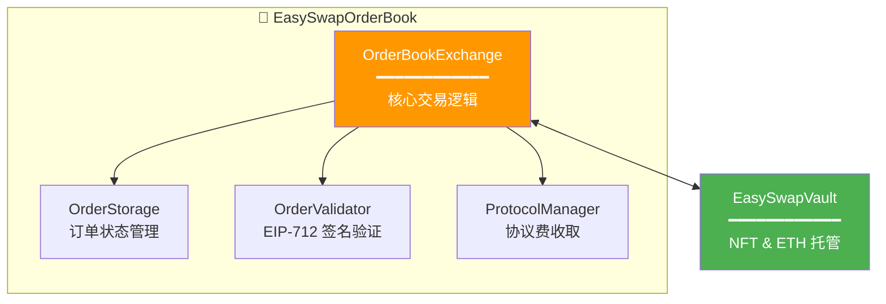
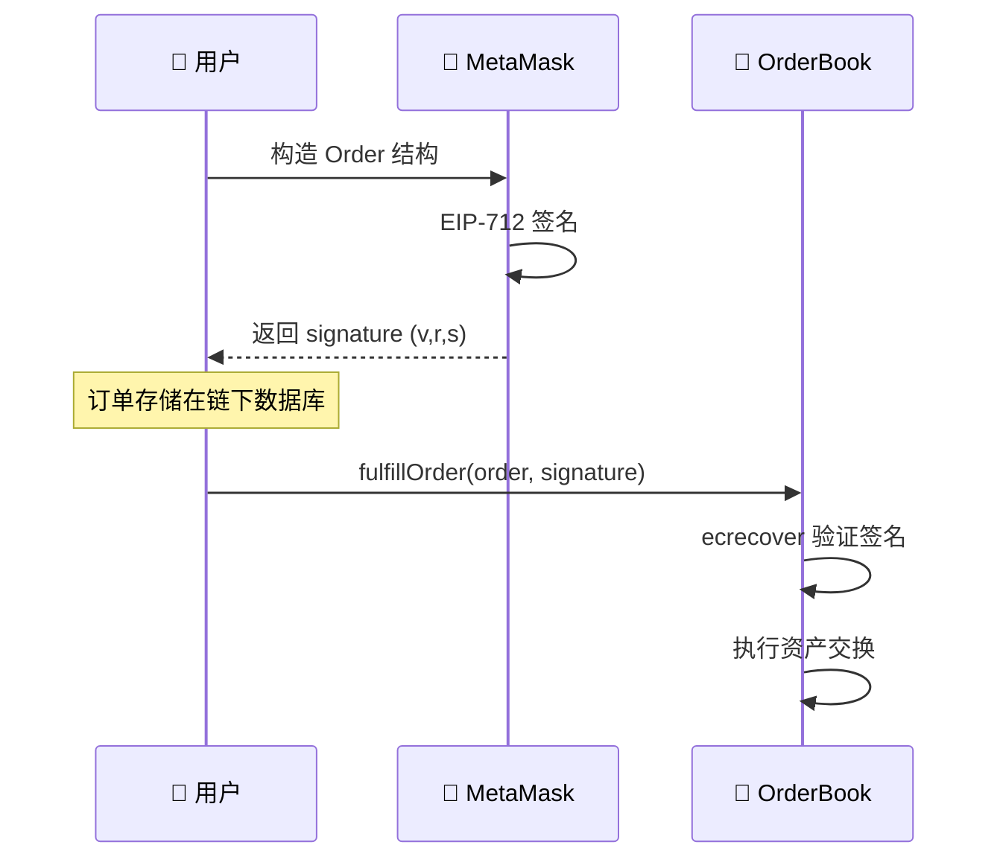

# 🔷 EasySwap Contract

> 基于 **链下订单簿 + 链上结算** 架构的 NFT 交易智能合约

[](https://soliditylang.org/)
[](https://hardhat.org/)
[](./LICENSE)

---

## 📖 项目简介

EasySwap Contract 是一套完整的 **NFT 订单簿交易系统智能合约**，采用类似 OpenSea / LooksRare 的架构设计：

- 🔐 **链下签名**：用户通过 EIP-712 签名创建订单，无需 Gas
- ⛓️ **链上结算**：资产交换在链上完成，保证安全性
- 💰 **资产托管**：独立的 Vault 合约管理 NFT 和 ETH
- 📊 **协议费管理**：灵活的手续费配置

---

## 🏗️ 合约架构

```
EasySwapContract/
├── contracts/
│   ├── EasySwapOrderBook.sol    # 核心交易合约 (OrderBookExchange)
│   ├── EasySwapVault.sol        # 资产托管合约 (OrderVault)
│   ├── OrderStorage.sol         # 订单存储模块
│   ├── OrderValidator.sol       # 订单验证模块
│   ├── ProtocolManager.sol      # 协议费管理模块
│   ├── interface/               # 接口定义
│   └── libraries/               # 工具库
├── scripts/                     # 部署脚本
├── test/                        # 测试用例
└── docs/                        # 文档资源
```

### 核心合约组件



| 合约 | 功能 | 说明 |
|:---|:---|:---|
| `EasySwapOrderBook` | 核心交易 | 订单撮合、签名验证、资产结算 |
| `EasySwapVault` | 资产托管 | 独立存储 NFT 和 ETH，隔离风险 |
| `OrderStorage` | 订单存储 | 管理订单状态 (Active/Fulfilled/Cancelled) |
| `OrderValidator` | 签名验证 | EIP-712 结构化签名验证 |
| `ProtocolManager` | 费用管理 | 协议手续费配置与收取 |

---

## ⚡ 核心功能

### 订单类型

| 类型 | 说明 | 流程 |
|:---|:---|:---|
| **Listing** | 卖家挂单出售 | 签名挂单 → 买家吃单 → 链上结算 |
| **Offer** | 买家对单品出价 | 存入 ETH → 签名出价 → 卖家接受 |
| **Collection Bid** | 买家对整个集合出价 | 存入 ETH → 集合出价 → 持有者接受 |

### 写入操作

```solidity
// 创建限价卖单 (Listing)
function createLimitSellOrder(Order calldata order, bytes calldata signature) external;

// 创建限价买单 (Offer/Bid)
function createLimitBuyOrder(Order calldata order) external payable;

// 成交订单
function fulfillOrder(Order calldata order, bytes calldata signature) external payable;

// 取消订单
function cancelOrder(bytes32 orderId) external;

// 批量成交
function batchFulfillOrders(Order[] calldata orders, bytes[] calldata signatures) external payable;
```

### 查询操作

```solidity
// 查询订单状态
function getOrderStatus(bytes32 orderId) external view returns (OrderStatus);

// 查询订单详情
function getOrder(bytes32 orderId) external view returns (Order memory);

// 验证订单签名
function verifyOrderSignature(Order calldata order, bytes calldata signature) external view returns (bool);
```

---

## 🔐 EIP-712 签名机制

采用 [EIP-712](https://eips.ethereum.org/EIPS/eip-712) 结构化数据签名，提升用户体验和安全性：

```solidity
// 订单结构
struct Order {
    address maker;           // 订单创建者
    address taker;           // 指定成交者 (0x0 表示任意)
    address collection;      // NFT 合约地址
    uint256 tokenId;         // Token ID
    uint256 price;           // 价格 (wei)
    uint256 expireTime;      // 过期时间
    uint256 salt;            // 随机数，防重放
    OrderType orderType;     // 订单类型
}

// Domain Separator
bytes32 DOMAIN_SEPARATOR = keccak256(
    abi.encode(
        keccak256("EIP712Domain(string name,string version,uint256 chainId,address verifyingContract)"),
        keccak256("EasySwap"),
        keccak256("1"),
        chainId,
        address(this)
    )
);
```

### 签名流程



---

## 📊 数据模型

### 核心实体

```sql
-- Collection: NFT 集合
CREATE TABLE ob_collection (
    id BIGINT PRIMARY KEY,
    address VARCHAR(42) UNIQUE,     -- 合约地址
    name VARCHAR(128),              -- 集合名称
    floor_price DECIMAL(30),        -- 地板价
    volume_total DECIMAL(30)        -- 总交易量
);

-- Item: NFT 单品
CREATE TABLE ob_item (
    id BIGINT PRIMARY KEY,
    collection_address VARCHAR(42), -- 所属集合
    token_id VARCHAR(128),          -- Token ID
    owner VARCHAR(42),              -- 当前持有者
    list_price DECIMAL(30)          -- 挂单价格
);

-- Order: 订单
CREATE TABLE ob_order (
    id BIGINT PRIMARY KEY,
    order_id VARCHAR(66) UNIQUE,    -- 订单 Hash
    order_type TINYINT,             -- 1:Listing 2:Offer 3:CollectionBid
    order_status TINYINT,           -- 订单状态
    maker VARCHAR(42),              -- 挂单者
    price DECIMAL(30)               -- 价格
);

-- Activity: 交易活动
CREATE TABLE ob_activity (
    id BIGINT PRIMARY KEY,
    activity_type TINYINT,          -- 活动类型
    tx_hash VARCHAR(66),            -- 交易哈希
    block_number BIGINT             -- 区块号
);
```

---

## 🚀 快速开始

### 环境要求

- Node.js >= 18.x
- npm / yarn / bun
- Hardhat

### 1. 安装依赖

```bash
npm install
```

### 2. 配置环境变量

```bash
cp .env.example .env
```

编辑 `.env` 文件：

```env
# Alchemy API Key
SEPOLIA_ALCHEMY_AK=your_alchemy_api_key

# 部署账户私钥
SEPOLIA_PK_ONE=your_private_key

# 测试账户私钥 (可选)
SEPOLIA_PK_TWO=another_private_key
```

### 3. 编译合约

```bash
npx hardhat compile
```

### 4. 运行测试

```bash
npx hardhat test
```

---

## 📦 部署

### 部署到 Sepolia 测试网

```bash
# 部署核心合约
npx hardhat run --network sepolia scripts/deploy.js

# 部署测试 ERC721 (可选)
npx hardhat run --network sepolia scripts/deploy_721.js
```

### 合约验证

```bash
npx hardhat verify --network sepolia <CONTRACT_ADDRESS> <CONSTRUCTOR_ARGS>
```

---

## 🛠️ 高级功能

### 查看合约大小

```bash
npx hardhat size-contracts
```

### 查看存储布局

使用 [Slither](https://github.com/crytic/slither) 分析工具：

```bash
slither-read-storage ./contracts/EasySwapOrderBook.sol \
    --contract-name EasySwapOrderBook \
    --solc-remaps @=node_modules/@ \
    --json storage_layout.json
```

### Gas 优化报告

```bash
REPORT_GAS=true npx hardhat test
```

---

## 📚 背景知识

### NFT 交易模式对比

| 模式 | 代表项目 | 价格机制 | 特点 |
|:---|:---|:---|:---|
| **订单簿 (OrderBook)** | OpenSea, LooksRare | 用户定价 | 灵活定价，适合高价值 NFT |
| **AMM** | Sudoswap | 曲线定价 | 即时交易，流动性好 |

### 本项目采用订单簿模式

- **Maker**: 挂单方（创建订单）
- **Taker**: 吃单方（成交订单）
- 价格由 Maker 确定，Taker 选择接受

### 相关标准

- [ERC-721](https://eips.ethereum.org/EIPS/eip-721): Non-Fungible Token Standard
- [EIP-712](https://eips.ethereum.org/EIPS/eip-712): Typed Structured Data Hashing and Signing
- [EIP-2981](https://eips.ethereum.org/EIPS/eip-2981): NFT Royalty Standard

---

## 🔗 相关项目

| 项目 | 说明 |
|:---|:---|
| [EasySwapBackend](../EasySwapBackend) | Go 后端 API 服务 |
| [EasySwapSync](../EasySwapSync) | 区块链数据同步服务 |
| [EasySwapBase](../EasySwapBase) | Go 公共工具库 |
| [nft-market-fe](../nft-market-fe) | Next.js 前端应用 |

---

## 📄 License

MIT License

---

> 📝 **文档版本**: v2.0  
> 📅 **更新日期**: 2026-02-08  
