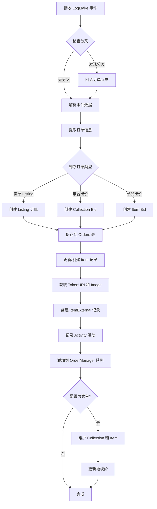
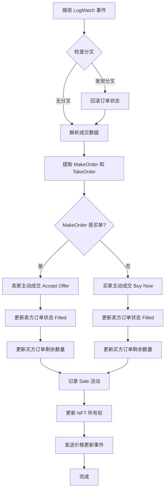
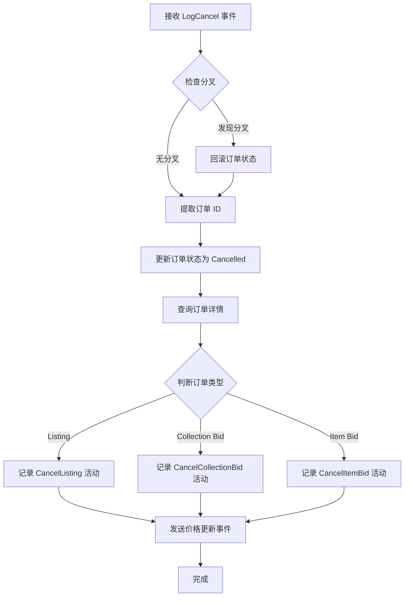

# OrderBook Indexer 服务架构分析

## 📋 目录
- [概述](#概述)
- [核心功能](#核心功能)
- [系统架构](#系统架构)
- [事件处理流程](#事件处理流程)
- [数据流图](#数据流图)
- [关键组件](#关键组件)

---

## 概述

**OrderBook Indexer** 是一个区块链事件监听和同步服务，负责将 EasySwapOrderBook 合约的链上事件同步到数据库，维护 NFT 交易市场的订单状态和集合地板价。

### 主要职责
- 🔍 监听链上订单簿合约事件（Make、Match、Cancel、Approval）
- 💾 将事件数据同步到数据库
- 📊 维护 NFT 集合地板价
- 🔄 处理区块链分叉（Reorg）

---

## 核心功能

### 1. 事件类型

| 事件类型 | Topic 签名 | 说明 |
|---------|-----------|------|
| **LogMake** | `0xfc37f2ff...` | 用户创建订单（挂单） |
| **LogMatch** | `0xf629aeca...` | 订单成交（买卖匹配） |
| **LogCancel** | `0x0ac8bb53...` | 用户取消订单 |
| **ERC721Approval** | `0x8c5be1e5...` | NFT 授权事件 |

### 2. 订单类型

```
订单类型分类：
├── 卖单 (Listing)
│   └── 固定价格出售
└── 买单 (Bid/Offer)
    ├── 集合出价 (Collection Offer)
    └── 单品出价 (Item Offer)
```

---

## 系统架构

### 整体架构图

```
┌─────────────────────────────────────────────────────────────┐
│                     OrderBook Indexer                        │
│                                                               │
│  ┌──────────────────┐         ┌──────────────────┐          │
│  │  Event Sync Loop │         │  Floor Price     │          │
│  │                  │         │  Maintenance     │          │
│  │  - 轮询区块      │         │  Loop            │          │
│  │  - 获取日志      │         │                  │          │
│  │  - 解析事件      │         │  - 定期更新      │          │
│  │  - 处理分叉      │         │  - 清理过期数据  │          │
│  └────────┬─────────┘         └──────────────────┘          │
│           │                                                   │
│           ▼                                                   │
│  ┌──────────────────────────────────────────────┐           │
│  │         Event Handler Router                  │           │
│  │                                                │           │
│  │  ┌──────────┐  ┌──────────┐  ┌──────────┐   │           │
│  │  │  Make    │  │  Match   │  │  Cancel  │   │           │
│  │  │ Handler  │  │ Handler  │  │ Handler  │   │           │
│  │  └──────────┘  └──────────┘  └──────────┘   │           │
│  │                                                │           │
│  │  ┌──────────┐                                 │           │
│  │  │ Approval │                                 │           │
│  │  │ Handler  │                                 │           │
│  │  └──────────┘                                 │           │
│  └────────────────┬─────────────────────────────┘           │
│                   │                                           │
└───────────────────┼───────────────────────────────────────────┘
                    │
                    ▼
┌───────────────────────────────────────────────────────────────┐
│                      数据持久层                                │
│                                                                │
│  ┌──────────┐  ┌──────────┐  ┌──────────┐  ┌──────────┐    │
│  │  Orders  │  │  Items   │  │Activity  │  │Collection│    │
│  │  Table   │  │  Table   │  │  Table   │  │  Table   │    │
│  └──────────┘  └──────────┘  └──────────┘  └──────────┘    │
│                                                                │
│  ┌──────────┐  ┌──────────┐                                  │
│  │  Item    │  │  Floor   │                                  │
│  │ External │  │  Price   │                                  │
│  └──────────┘  └──────────┘                                  │
└───────────────────────────────────────────────────────────────┘
```

---

## 事件处理流程

### 1. 主同步循环时序图

```
┌──────────────┐         ┌─────────────┐         ┌──────────┐         ┌──────────────┐
│ SyncEventLoop│         │ ChainClient │         │ Database │         │ EventHandler │
└──────┬───────┘         └──────┬──────┘         └────┬─────┘         └──────┬───────┘
       │                        │                     │                       │
       │ 【每 10 秒循环一次】    │                     │                       │
       │                        │                     │                       │
       │  1. 获取上次同步区块高度                      │                       │
       │────────────────────────────────────────────>│                       │
       │                        │                     │                       │
       │  lastSyncBlock         │                     │                       │
       │<────────────────────────────────────────────│                       │
       │                        │                     │                       │
       │  2. 获取当前区块高度    │                     │                       │
       │───────────────────────>│                     │                       │
       │                        │                     │                       │
       │  currentBlockNum       │                     │                       │
       │<───────────────────────│                     │                       │
       │                        │                     │                       │
       │  3. 判断是否需要同步    │                     │                       │
       │                        │                     │                       │
       │  【如果需要同步】       │                     │                       │
       │                        │                     │                       │
       │  4. 请求日志 [startBlock, endBlock]          │                       │
       │───────────────────────>│                     │                       │
       │                        │                     │                       │
       │  logs[]                │                     │                       │
       │<───────────────────────│                     │                       │
       │                        │                     │                       │
       │  5. 遍历每个日志，根据 Topic 路由事件          │                       │
       │───────────────────────────────────────────────────────────────────>│
       │                        │                     │                       │
       │  6. 更新数据库          │                     │                       │
       │                        │                     │<──────────────────────│
       │                        │                     │                       │
       │  7. 更新同步进度        │                     │                       │
       │────────────────────────────────────────────>│                       │
       │                        │                     │                       │
       │  【如果不需要同步】     │                     │                       │
       │                        │                     │                       │
       │  sleep(10s)            │                     │                       │
       │───────┐                │                     │                       │
       │       │                │                     │                       │
       │<──────┘                │                     │                       │
       │                        │                     │                       │
       │  【循环继续...】        │                     │                       │
       │                        │                     │                       │
```

### 2. Make 事件处理流程



### 3. Match 事件处理流程



### 4. Cancel 事件处理流程



---

## 数据流图

### 订单生命周期

```
┌─────────────┐
│   用户挂单   │
│  (LogMake)  │
└──────┬──────┘
       │
       ▼
┌─────────────────────────────────┐
│  订单状态: Active                │
│  - 保存到 Orders 表              │
│  - 创建 Activity 记录            │
│  - 更新 Item 信息                │
│  - 加入 OrderManager 队列        │
└──────┬──────────────────────────┘
       │
       ├──────────────┬──────────────┐
       │              │              │
       ▼              ▼              ▼
┌──────────┐   ┌──────────┐   ┌──────────┐
│   成交    │   │   取消    │   │   过期    │
│(LogMatch)│   │(LogCancel)│   │(Manager) │
└────┬─────┘   └────┬─────┘   └────┬─────┘
     │              │              │
     ▼              ▼              ▼
┌─────────────────────────────────────┐
│  订单状态: Filled/Cancelled/Expired │
│  - 更新订单状态                      │
│  - 记录 Activity                    │
│  - 更新 NFT 所有权 (成交时)         │
│  - 触发地板价更新                    │
└─────────────────────────────────────┘
```

### 地板价维护流程

```
┌──────────────────────────────────────┐
│     定时任务 (每天执行)               │
│                                       │
│  1. 查询所有集合的最低上架价          │
│     SELECT MIN(price)                 │
│     FROM items                        │
│     WHERE order_status = Active       │
│     GROUP BY collection_address       │
│                                       │
│  2. 批量更新 Collection 表            │
│     UPDATE collections                │
│     SET floor_price = ?               │
│                                       │
│  3. 记录到 FloorPriceChange 表        │
│     INSERT INTO floor_price_change    │
│                                       │
│  4. 清理过期历史记录 (30天前)        │
│     DELETE FROM floor_price_change    │
│     WHERE event_time < NOW() - 30d    │
└──────────────────────────────────────┘
```

---

## 关键组件

### 1. 分叉检测与处理

```go
// 分叉检测逻辑
检查交易哈希是否存在但区块高度不同
  ↓
如果检测到分叉:
  1. 回滚订单状态
     - Sale → Active (恢复订单)
     - Cancel → Active (恢复订单)
  2. 恢复 NFT 所有权
  3. 删除分叉前的 Activity 记录
  ↓
重新处理新区块的事件
```

### 2. 订单状态机

```
┌─────────┐
│  Active │ ◄─── 初始状态 (LogMake)
└────┬────┘
     │
     ├──────► Filled (LogMatch - 完全成交)
     │
     ├──────► Cancelled (LogCancel - 用户取消)
     │
     └──────► Expired (OrderManager - 过期)
```

### 3. NFT 授权检查

```go
// 授权验证流程
调用 ERC721.getApproved(tokenId)
  ↓
获取当前授权地址
  ↓
比较是否等于 Vault 合约地址
  ↓
返回授权状态 (true/false)
```

### 4. 元数据获取流程

```
调用合约 tokenURI(tokenId)
  ↓
获取 metadata_uri
  ↓
HTTP 请求获取 JSON
  ↓
解析 JSON 提取 image 字段
  ↓
保存到 ItemExternal 表
```

---

## 配置参数

| 参数 | 值 | 说明 |
|-----|---|------|
| `SleepInterval` | 10秒 | 轮询间隔 |
| `SyncBlockPeriod` | 100 | 每次同步区块数 |
| `MaxBlockDifference` | 8 | 安全确认区块数 |
| `EventIndexType` | 6 | 索引类型标识 |

---

## 数据库表结构

### Orders 表
- 存储所有订单信息
- 状态: Active, Filled, Cancelled, Expired
- 类型: Listing, ItemBid, CollectionBid

### Items 表
- 存储 NFT 基本信息
- 包含: owner, list_price, list_time

### ItemExternal 表
- 存储 NFT 扩展信息
- 包含: metadata_uri, image_uri, oss_uri

### Activity 表
- 记录所有交易活动
- 类型: Listing, Sale, Cancel, Bid

### Collection 表
- 存储集合信息
- 包含: floor_price, volume_total

### FloorPriceChange 表
- 记录地板价历史变化
- 用于趋势分析

---

## 错误处理

### 1. RPC 错误处理
- 请求失败时减少批量大小
- 从 100 个区块降至 1 个区块
- 重试机制

### 2. 分叉处理
- 检测交易哈希冲突
- 自动回滚状态
- 重新处理事件

### 3. 元数据获取失败
- 记录警告日志
- 继续处理（不阻塞主流程）
- 后续可重试

---

## 性能优化

### 1. 批量处理
- 每次同步 100 个区块
- 批量插入数据库（避免单条插入）

### 2. 并发安全
- 使用 `threading.GoSafe` 启动协程
- 数据库事务保证一致性

### 3. 索引优化
- 唯一索引: (collection_address, token_id)
- 查询索引: order_status, expire_time

---

## 监控指标

### 关键指标
- ✅ 同步延迟: 当前区块 - 最后同步区块
- ✅ 事件处理速度: 每秒处理事件数
- ✅ 分叉检测次数
- ✅ 数据库写入失败率
- ✅ RPC 请求失败率

---

## 总结

OrderBook Indexer 是一个健壮的区块链事件同步服务，具备以下特点:

1. **可靠性**: 分叉检测与自动回滚
2. **完整性**: 覆盖所有订单生命周期事件
3. **扩展性**: 支持多链部署
4. **性能**: 批量处理和优化查询
5. **可维护性**: 清晰的代码结构和日志记录

该服务是 NFT 交易市场的核心基础设施，确保链上数据与数据库的一致性。
