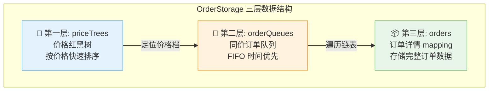
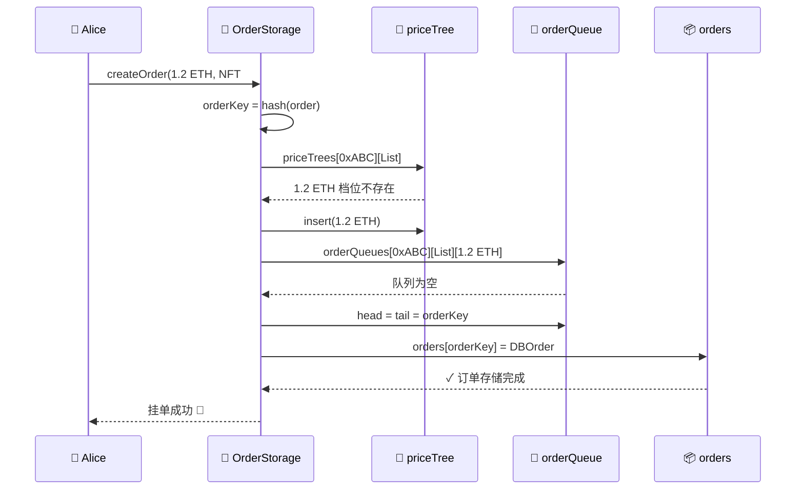
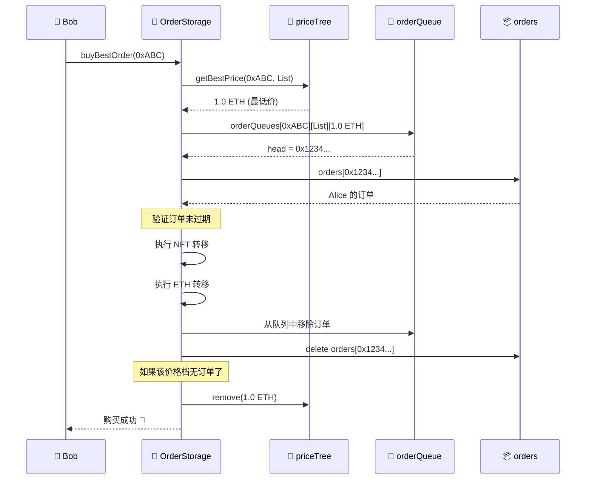

# OrderStorage 数据结构详解

> 本文档详细介绍 `OrderStorage` 合约中使用的核心数据结构，包括价格红黑树、同价订单队列和订单详情的可视化说明。

---

## 📊 整体数据结构概览



---

## 🌲 第一层：价格红黑树 (priceTrees)

### 数据定义

```solidity
// collection地址 → 买卖方向 → 红黑树
mapping(address => mapping(LibOrder.Side => RedBlackTreeLibrary.Tree)) public priceTrees;
```

### 可视化

以某个 NFT Collection (地址: `0xABC...`) 为例：

```
                    priceTrees[0xABC...]
                           │
            ┌──────────────┴──────────────┐
            │                             │
      Side.List                      Side.Bid
      (卖单价格树)                    (买单价格树)
            │                             │
            ▼                             ▼
    ┌───────────────┐             ┌───────────────┐
    │   红黑树      │             │   红黑树      │
    │  (低价优先)   │             │  (高价优先)   │
    └───────────────┘             └───────────────┘
```

### List 侧红黑树示例（低价优先）

```
                    1.5 ETH (根节点, 黑色)
                   /                \
            1.2 ETH (红)         1.8 ETH (红)
            /      \              /      \
        1.0 ETH   1.3 ETH    1.6 ETH   2.0 ETH
        
        
取最优价: first() → 1.0 ETH (最低价)
下一档价: next(1.0) → 1.2 ETH
```

### Bid 侧红黑树示例（高价优先）

```
                    0.8 ETH (根节点, 黑色)
                   /                \
            0.6 ETH (红)         1.0 ETH (红)
            /      \              /      \
        0.5 ETH   0.7 ETH    0.9 ETH   1.2 ETH
        
        
取最优价: last() → 1.2 ETH (最高价)
下一档价: prev(1.2) → 1.0 ETH
```

### 为什么用红黑树？

| 操作 | 时间复杂度 | 说明 |
|:---|:---|:---|
| 插入价格档 | O(log n) | 新订单的价格不存在时 |
| 删除价格档 | O(log n) | 该价格下所有订单都被取消/成交时 |
| 查找最优价 | O(log n) | `first()` 或 `last()` |
| 查找下一档 | O(log n) | `next()` 或 `prev()` |

---

## 🔗 第二层：同价订单队列 (orderQueues)

### 数据定义

```solidity
// collection → side → price → 订单队列（链表头尾）
mapping(address => mapping(LibOrder.Side => mapping(Price => LibOrder.OrderQueue))) public orderQueues;

// 队列结构
struct OrderQueue {
    OrderKey head;  // 链表头（最早的订单）
    OrderKey tail;  // 链表尾（最新的订单）
}
```

### 可视化

以 `Collection: 0xABC..., Side: List, Price: 1.2 ETH` 为例：

```
orderQueues[0xABC...][List][1.2 ETH]
                │
                ▼
        ┌─────────────────┐
        │   OrderQueue    │
        │  head ──────────┼──┐
        │  tail ──────────┼──┼──────────────────────────┐
        └─────────────────┘  │                          │
                             ▼                          ▼
                    ┌─────────────┐    ┌─────────────┐    ┌─────────────┐
                    │  Order #1   │───▶│  Order #2   │───▶│  Order #3   │───▶ SENTINEL
                    │ (10:00 AM)  │    │ (10:05 AM)  │    │ (10:10 AM)  │
                    │ maker: Alice│    │ maker: Bob  │    │ maker: Carol│
                    └─────────────┘    └─────────────┘    └─────────────┘
                         ▲                                      ▲
                         │                                      │
                       head                                   tail
                    (最早挂单)                              (最新挂单)
```

### FIFO 队列操作

```
新订单插入 (尾插):
┌───┐   ┌───┐   ┌───┐   ┌───┐
│ 1 │──▶│ 2 │──▶│ 3 │──▶│ 4 │ ← 新订单加入队尾
└───┘   └───┘   └───┘   └───┘
  ▲                       ▲
head                    tail


订单成交/取消 (从链表中摘除):
成交 Order #2 后:
┌───┐   ┌───┐   ┌───┐
│ 1 │──▶│ 3 │──▶│ 4 │
└───┘   └───┘   └───┘
```

### 为什么用链表？

| 优点 | 说明 |
|:---|:---|
| **时间优先 (FIFO)** | 先挂单的排在前面，保证公平性 |
| **O(1) 插入** | 新订单直接加到队尾 |
| **无需移动元素** | 删除订单只需修改指针 |

---

## 📦 第三层：订单详情 (orders)

### 数据定义

```solidity
// orderKey（订单哈希）→ 完整订单数据
mapping(OrderKey => LibOrder.DBOrder) public orders;

struct DBOrder {
    Order order;      // 订单主体
    OrderKey next;    // 指向同价队列中的下一个订单
}

struct Order {
    address maker;           // 订单创建者
    LibOrder.Side side;      // Bid 或 List
    LibOrder.SaleKind saleKind;  // 一口价/集合出价等
    uint256 expiry;          // 过期时间
    uint256 salt;            // 随机数（防重放）
    NFTInfo nft;             // NFT 信息
    Price price;             // 价格
}

struct NFTInfo {
    address collection;      // NFT 合约地址
    uint256 tokenId;         // Token ID
    uint256 amount;          // 数量 (ERC721 = 1)
}
```

### 可视化

```
orders mapping:
┌──────────────────────────────────────────────────────────────────┐
│  OrderKey (bytes32)           │        DBOrder                   │
├──────────────────────────────────────────────────────────────────┤
│  0x1234...abcd               │  ┌─────────────────────────────┐ │
│                               │  │ Order:                      │ │
│                               │  │   maker: 0xAlice...         │ │
│                               │  │   side: List                │ │
│                               │  │   price: 1.2 ETH            │ │
│                               │  │   nft.collection: 0xABC...  │ │
│                               │  │   nft.tokenId: 42           │ │
│                               │  │   expiry: 1707350400        │ │
│                               │  ├─────────────────────────────┤ │
│                               │  │ next: 0x5678...efgh         │ │
│                               │  └─────────────────────────────┘ │
├──────────────────────────────────────────────────────────────────┤
│  0x5678...efgh               │  ┌─────────────────────────────┐ │
│                               │  │ Order:                      │ │
│                               │  │   maker: 0xBob...           │ │
│                               │  │   side: List                │ │
│                               │  │   price: 1.2 ETH            │ │
│                               │  │   ...                       │ │
│                               │  ├─────────────────────────────┤ │
│                               │  │ next: SENTINEL (结束)       │ │
│                               │  └─────────────────────────────┘ │
└──────────────────────────────────────────────────────────────────┘
```

### OrderKey 计算

```solidity
// OrderKey = keccak256(order 的所有字段)
function hash(Order memory order) internal pure returns (OrderKey) {
    return OrderKey.wrap(
        keccak256(
            abi.encode(
                order.maker,
                order.side,
                order.saleKind,
                order.expiry,
                order.salt,
                order.nft.collection,
                order.nft.tokenId,
                order.nft.amount,
                order.price
            )
        )
    );
}
```

---

## 🔄 完整数据流示例

### 场景：Alice 以 1.2 ETH 挂单出售 NFT #42



### 场景：Bob 购买最便宜的 NFT



---

## 📈 数据结构复杂度总结

| 操作 | 数据结构 | 复杂度 | 说明 |
|:---|:---|:---|:---|
| 查找最优价 | 红黑树 | O(log n) | `first()` / `last()` |
| 插入新价格档 | 红黑树 | O(log n) | 该价格首次出现时 |
| 删除空价格档 | 红黑树 | O(log n) | 该价格下订单清空时 |
| 插入订单 | 链表 | O(1) | 尾插 |
| 删除指定订单 | 链表 | O(n) | 需遍历找到目标 |
| 读取订单详情 | mapping | O(1) | 直接通过 key 访问 |

---

## 💡 设计亮点

1. **三层分离**：价格排序、时间排序、数据存储各司其职
2. **双向查询**：支持从高到低（Bid）和从低到高（List）遍历
3. **空间优化**：空价格档自动从树中删除，节省存储
4. **公平撮合**：同价订单按时间顺序成交，先到先得

---

> 📝 **文档版本**: v1.0  
> 📅 **更新日期**: 2026-02-08
