# NFT Marketplace 项目架构文档

> 本文档详细介绍 NFT Marketplace 项目的整体架构设计，包含系统架构、数据流程、交易逻辑等核心内容。

---

## 目录

- [1. 项目概述](#1-项目概述)
- [2. 系统架构图](#2-系统架构图)
- [3. 模块详解](#3-模块详解)
- [4. 数据模型](#4-数据模型)
- [5. 核心业务流程](#5-核心业务流程)
- [6. 智能合约架构](#6-智能合约架构)
- [7. 数据同步流程](#7-数据同步流程)
- [8. 技术栈总览](#8-技术栈总览)

---

## 1. 项目概述

这是一个 **全栈去中心化 NFT 交易市场**，采用 **链下订单簿 + 链上结算** 架构，类似于 OpenSea 或 LooksRare 的设计模式。

### 核心特点

- 🔗 **链上链下结合**：订单签名在链下，资产结算在链上
- 📚 **订单簿模式**：非 AMM，支持限价单交易
- 🏗️ **微服务架构**：API 服务、数据同步服务分离
- ⚡ **高性能查询**：链下数据库支撑高效查询

---

## 2. 系统架构图

### 2.1 整体架构

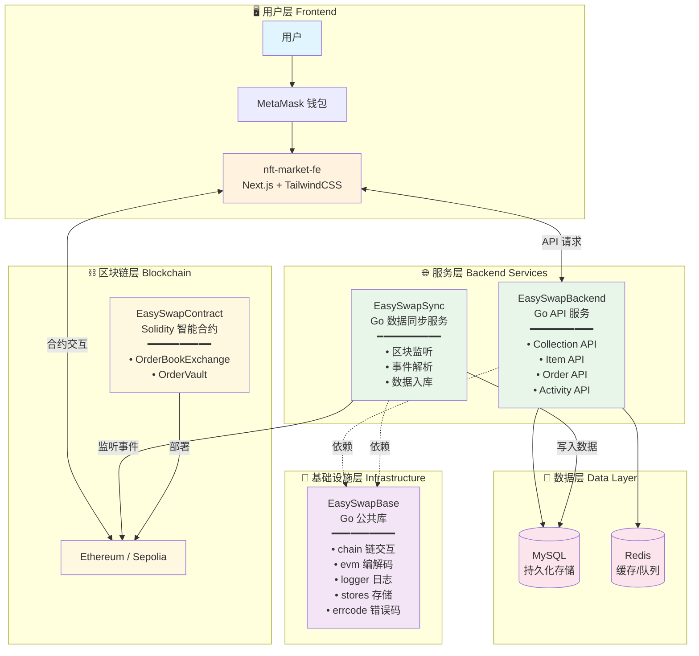

### 2.2 模块依赖关系

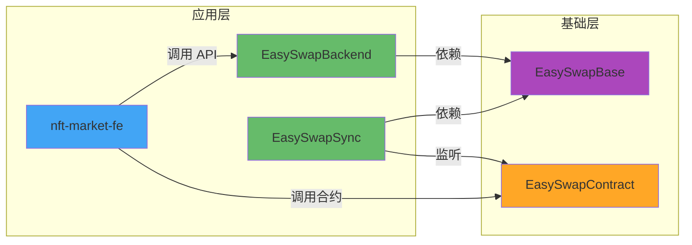

---

## 3. 模块详解

### 3.1 模块总览表

| 目录 | 角色 | 技术栈 | 核心职责 |
|:---|:---|:---|:---|
| `EasySwapContract` | 💎 核心逻辑 | Solidity, Hardhat | 链上订单簿交易撮合 |
| `EasySwapSync` | 🔄 数据索引器 | Go | 监听链上事件，同步到数据库 |
| `EasySwapBackend` | 🌐 API 服务 | Go | 为前端提供高性能查询接口 |
| `EasySwapBase` | 🧰 基础设施 | Go | 公共工具库（日志、链交互、错误码等） |
| `nft-market-fe` | 🖥️ 前端界面 | Next.js, TS, Tailwind | 用户交互界面 |

### 3.2 EasySwapBase 公共库结构

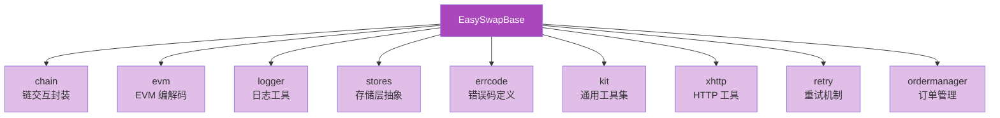

### 3.3 前端模块结构

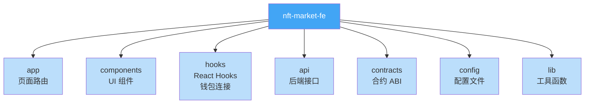

---

## 4. 数据模型

### 4.1 核心实体关系

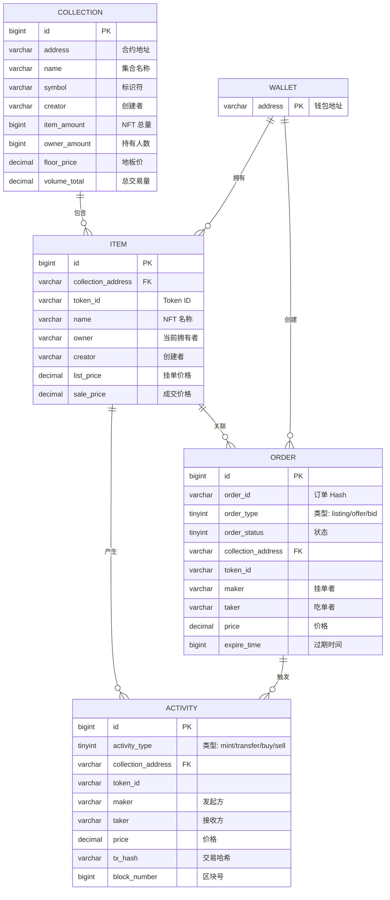

### 4.2 订单类型说明

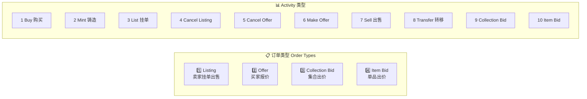

---

## 5. 核心业务流程

### 5.1 NFT 挂单出售流程 (Listing Flow)

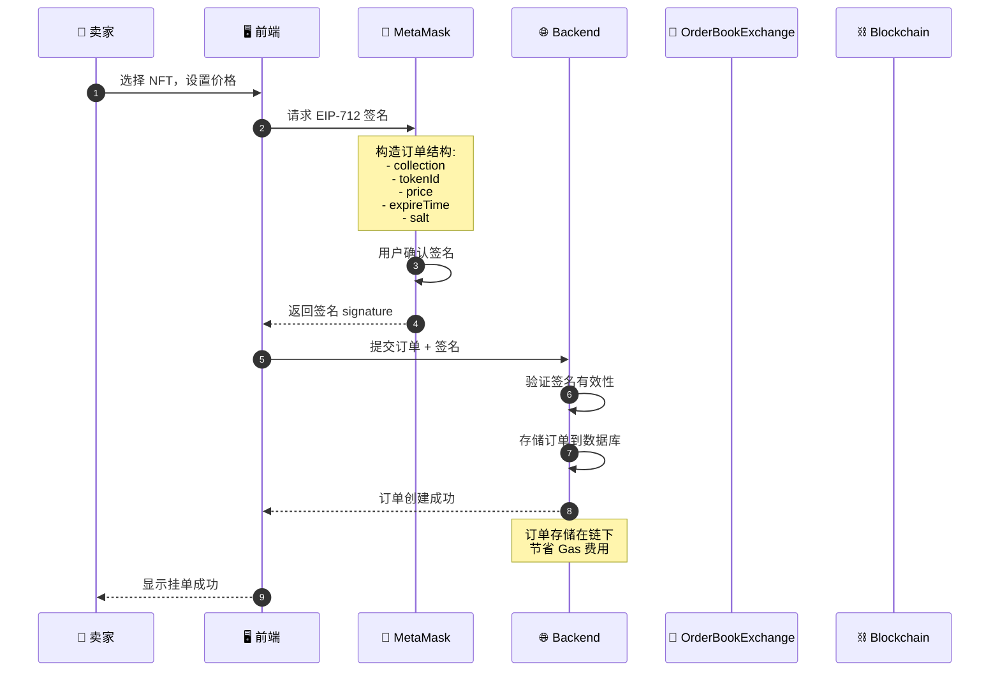

### 5.2 NFT 购买流程 (Buy Flow)

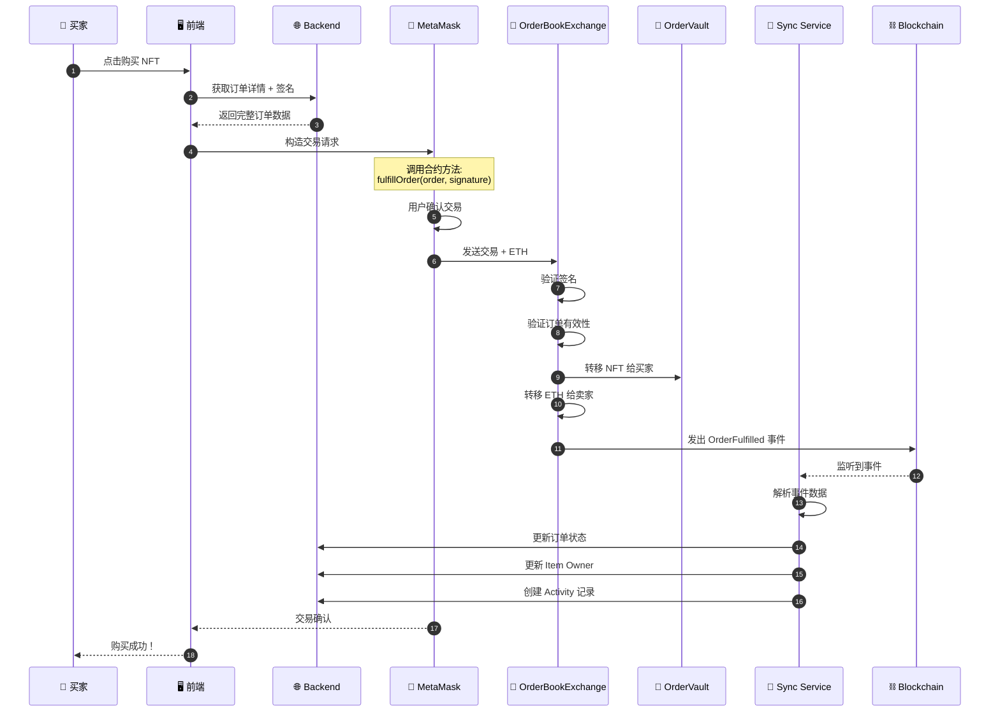

### 5.3 订单簿交易完整流程

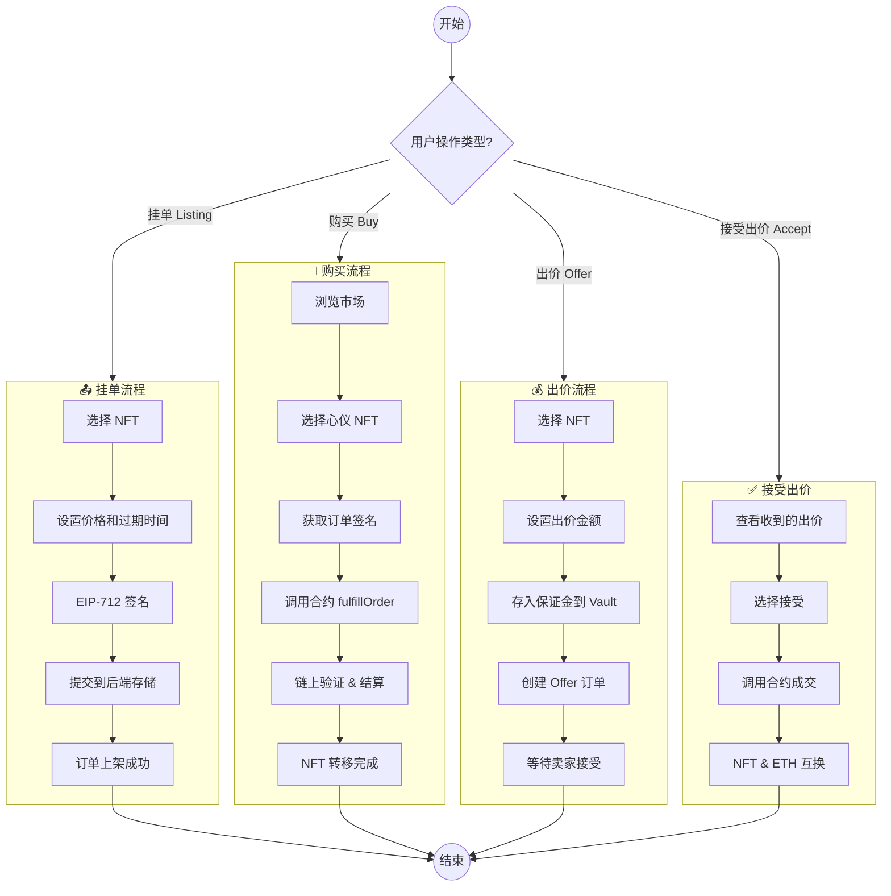

### 5.4 订单状态流转

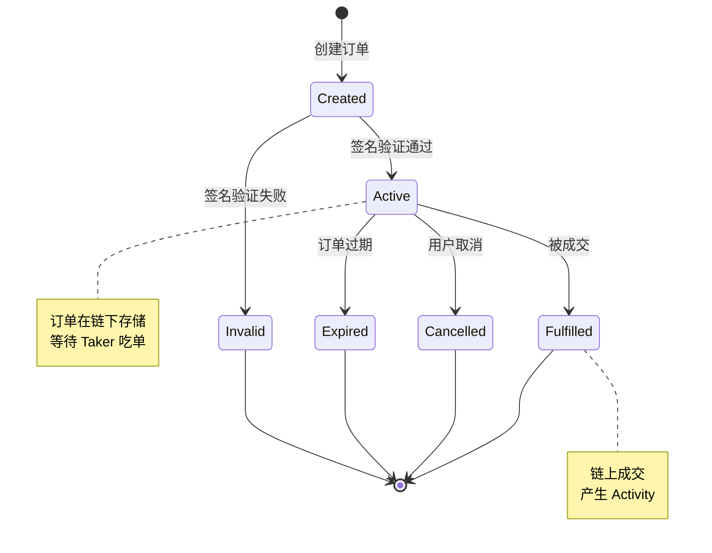

---

## 6. 智能合约架构

### 6.1 合约组件结构

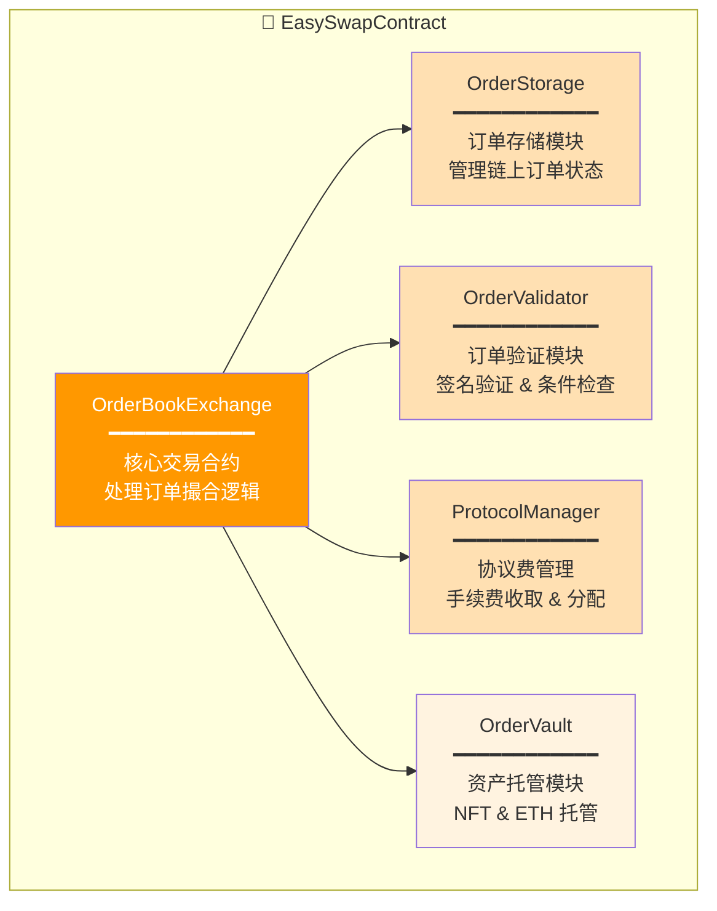

### 6.2 合约交互流程

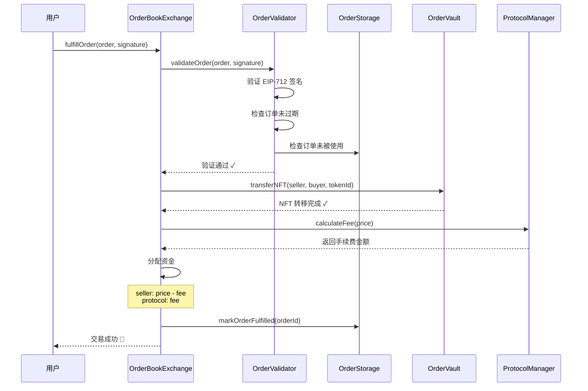

### 6.3 EIP-712 签名验证

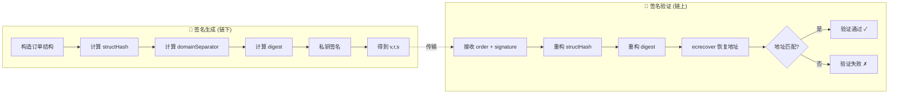

---

## 7. 数据同步流程

### 7.1 EasySwapSync 工作流程

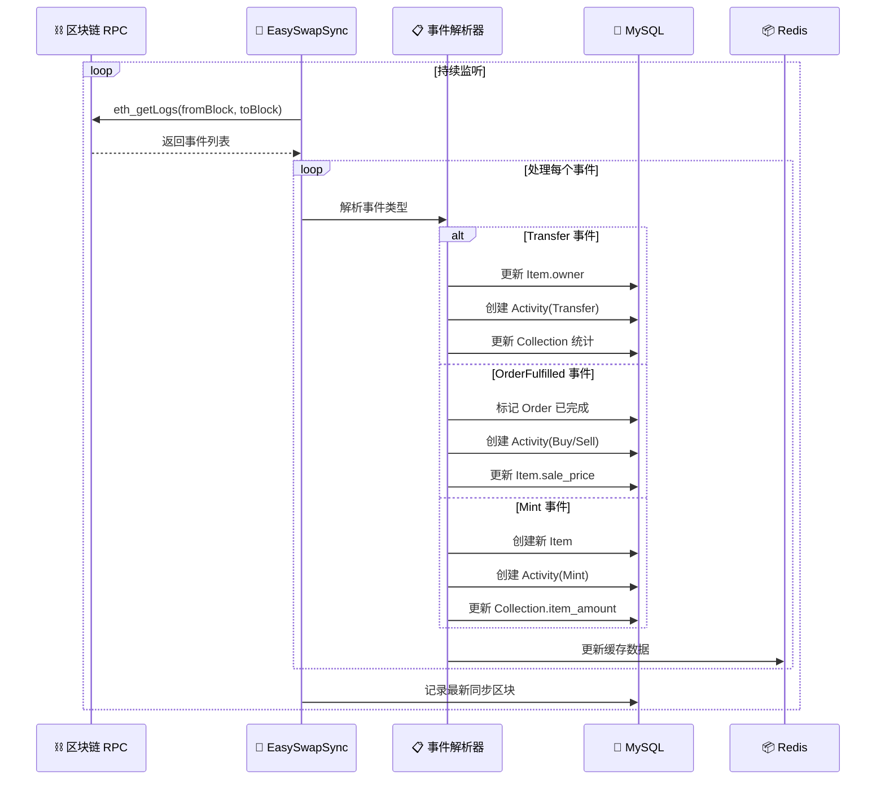

### 7.2 区块回滚处理

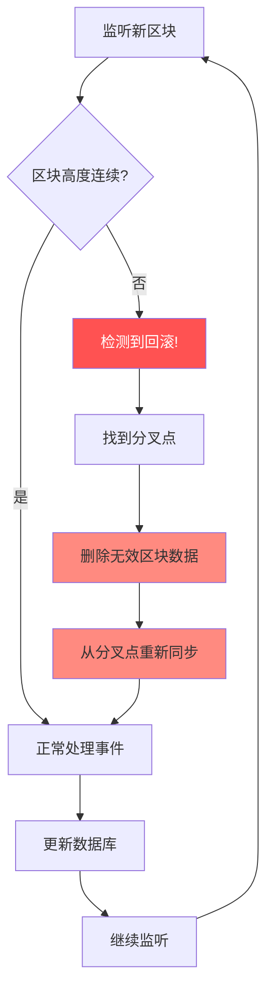

### 7.3 事件类型映射

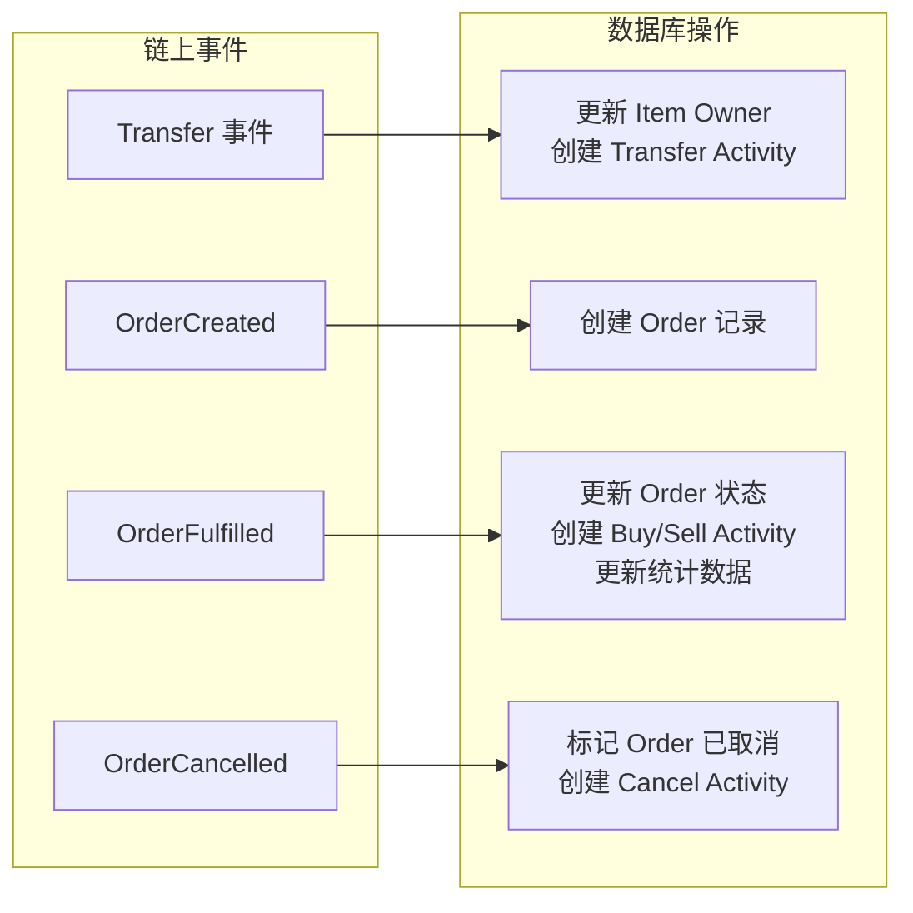

---

## 8. 技术栈总览

### 8.1 技术选型

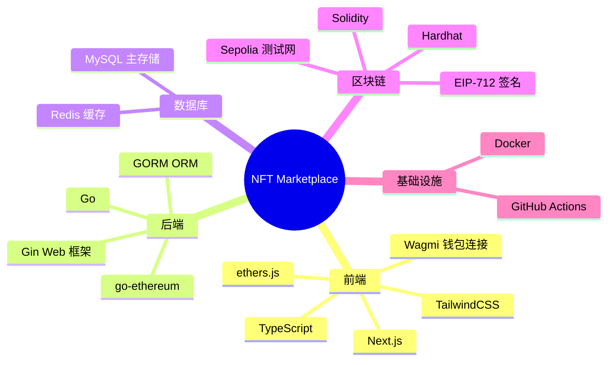

### 8.2 开发环境要求

| 组件 | 版本要求 |
|:---|:---|
| Node.js | >= 18.x |
| Go | >= 1.18 |
| MySQL | >= 8.0 |
| Redis | >= 6.0 |
| Hardhat | Latest |

### 8.3 项目启动流程

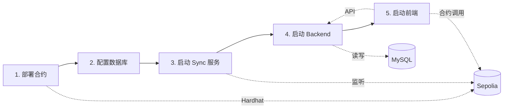

---

## 附录：学习路线建议

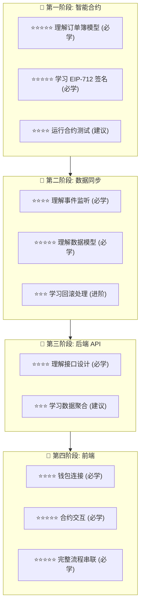

---

> 📝 **文档版本**: v1.0  
> 📅 **更新日期**: 2026-02-07  
> 🔗 **项目地址**: [GitHub Repository](https://github.com/MetaNodeAcademy/ProjectBreakdown-NFTMarket)
